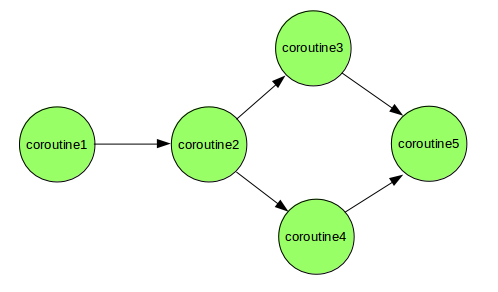

= PART C: Expert Python
:doctype: book
:sectnums:
:docinfo:
:toc:

== Requirements

== Generators

A generator is any function that uses the `yield` keyword at least once. They compute their values
on demand. This is known as lazy evaluation. Generators are iterators, but you can only iterate
over them once and must be reinitialized to iterate over them again. Generators are useful when
you need to generate a large number of values and don’t want to store them all in memory at the
same time.

The `yield` statement suspends the function’s execution and sends a value back to the caller, but
retains its state so that it can be resumed. When resumed, the function continues execution
immediately after the last yield run. This allows its code to produce a series of values over
time, rather than computing them at once and sending them back like a single list.

[source, python]
----
include::examples/c/02_generators/examples/generator_concept.py[]
----

The __iter()__ method of the iterator protocol can be implemented as a generator. The advantages
of generators are mainly the reduced memory footprint and the lazy evaluation of an expression.
Values in generator expressions are calculated only on demand. This is especially useful when
the number of values is very large or infinite.

[source, python]
----
include::examples/c/02_generators/examples/generator_infinite.py[]
----

=== Comprehensions

A generator expression is a generator version of a list comprehension. It is a compact way of
creating a generator without having to define a function.

The syntax of a generator expression is similar to that of a list comprehension. The only
difference is that it uses parentheses instead of square brackets. In the generic syntax of
generator comrehensions `<expression>` is any single line of Python code returning an object.

[source, console]
----
 (<expression> for <var> in <iterable> if <condition>
----

An example of a generator expression:

[source, python]
----
include::examples/c/02_generators/examples/generator_expression.py[]
----

which is equivalent to:

[source, python]
----
include::examples/c/02_generators/examples/generator_expression_equivalent.py[]
----

Another more complex example of a generator expression:

[source, python]
----
include::examples/c/02_generators/examples/generator_expression_complex.py[]
----

In Python 3.8, the walrus operator `:=` was introduced. It allows you to assign values to variables
within an expression. This allows you to use assignment expressions in generator expressions. For
example, you can use assignment expressions to filter a list of numbers and return only the even
numbers.

[source, python]
----
include::examples/c/02_generators/examples/generator_expression_walrus.py[]
----

The generator have more or less the same usage as functions. They can be nested, passed as
arguments, returned from functions, etc. It is also even possible to implemente a recursive
generator.

*Nested Generators*

[source, python]
----
include::examples/c/02_generators/examples/generator_nested.py[]
----

*Returning Generators*

[source, python]
----
include::examples/c/02_generators/examples/generator_recursive.py[]
----

*Passing Generators*

[source, python]
----
include::examples/c/02_generators/examples/generator_passing.py[]
----

*Delegation*

Python 3 introduced the `yield from` statement. It allows you to delegate part of the responsibility
for a sub-generator to another generator. This is useful when you want to split the logic of a
generator into multiple sub-generators.

[source, python]
----
include::examples/c/02_generators/examples/generator_delegation.py[]
----

=== Performance

Generators are used mainly for memory efficiency but at the cost of increased complexity and
overhead required to  save the current state of the generator function.

=== Use Cases

- Computing large sets of values (particularly infinite sets)
- Increased readability and maintainability of code
- Reduced memory footprint

=== Excercises

. Write an infinite counter generator using the generator syntax
. Write a program to compare memory size of list and generator comprehensions
. Write a generator which calculates fibonacci numbers up to a given limit
. Write a city ranking generator with delegation (split in city and limit generators)
. Write a recursive generator for odd numbers (please, please never do this in real life!!!)

== Coroutines

Coroutines are a particular type of generator function and represent generalizations of
subroutines.They are used for cooperative multitasking where a process voluntarily yields (gives
away) control periodically or when idle to enable multiple applications to run simultaneously.
 Typically they are used to waiting for a signal from another subroutine or coroutine to resume
its execution.

=== Execution

A coroutine is a generator function that uses the `yield` keyword to suspend its execution but
offering also the possibility to send data back to the coroutine. The `yield` keyword is used to
suspend the execution of the coroutine and to generate a value. The `yield` keyword can be used
in two different ways:

. `yield` can be used as an expression to generate a value
. `yield` can be used as a statement to suspend the execution of the coroutine

[source, python]
----
include::examples/c/03_coroutines/examples/coroutine_execution.py[]
----

1. The first usage of next() will activate the coroutine, print, initialize the output
and start the loop.

2. The first result will be generated when the loop reaches the yield
output expression.

3. The second usage of next will resume the coroutine with the first statement after yield.
As next() doesn't send any data the coroutine will print ('Coroutine received :', None).

4. The output value is changed and the while loop is executed again. When the coroutine reaches
   the yield statement it will generate an output with the yield output expression.

5. The send method of generator functions is used to send data to the coroutine.The `text = yield
   output` statement captures the value sent and the first statement after yield is executed. In
   this case, the coroutine will print('Coroutine received :', 'abc').

6. The output is then changed to take the reverse value of the input. Then the while loop is
   executed again and the new output is generated with the yield output expression.

=== Interface

[otions, header]
|====
| Method | Example             | Description

| next   |   next(coroutine)   | Generate value from the coroutine

| send   |  coroutine.send(..) | Send a value to the coroutine

| close  | coroutine.close(..) | Stop the coroutine by sending a GeneratorExit signal

| throw  | coroutine.throw(..) | Throw an exception to the coroutine for the next yield

|====

=== Chaining

Coroutines can be used to set pipes. We can chain together coroutines and push data through the
ipe using the `send()` method. A pipe needs at least the following

1. An initial source or producer
2. A sink or consumer

[source, python]
----
include::examples/c/03_coroutines/examples/coroutine_chaining.py[]
----

=== Commparison

*Coroutine vs Subroutine*

[options, header]
|====
| Coroutine | Subroutine

| 
| 

a|
- Coroutines use yield to return a value and suspend execution
- Coroutines may execute in parallel

a|
- Subroutines use return to return a value and stop execution
- Subroutines execute sequentially

|====

*Coroutine vs Thread*

[options, header]
|====
| Coroutine | Thread

| Coroutines are managed by the program and the programming language
| Threads are managed by the operating system

|====

*Coroutine vs Generator*

[options, header]
|====
| Coroutine | Generator

| Coroutines use `yield` to suspend execution and receive a value
| Generators use `yield` to suspend execution and return a value

|====

=== Use Cases

. Pipelines used to filter or map objects
. Finite state machines
. Event handling
. Cooperative multi-tasking
. Callbacks replacement

=== Excercises

1. Write a simple decorator to activate a coroutine
2. Write a coroutine that computes the running average
3. Write a random configurable byte stream generator
4. Write a pipeline
5. Write simple finite state machine
6. Write a program to generate permutations using recursive coroutines
7. Write a simple multi-tasking OS using coroutines

== Meta Programming

Metaprogramming is a programming technique where a program is designed to manipulate or generate
code during runtime. It allows a program to treat code as data and work with it programmatically.
Metaprogramming can be a powerful tool in a developer's toolbox, but it should be used
judiciously, as it can make code more complex and harder to understand.

Here are some common forms and examples of metaprogramming:

- *Code Generation*: In this form of metaprogramming, code is generated programmatically. For
example, you might have a template for generating database access code based on a data model.
Instead of writing the code manually for each table, you use metaprogramming to generate it
automatically.

- *Reflection*: Reflection is the ability of a program to inspect and manipulate its own structure,
classes, methods, and properties at runtime. In languages like Java or C#, you can use
reflection to examine and modify classes, invoke methods, or access fields dynamically.

- *Dynamic Loading*: This involves loading and unloading code modules dynamically at runtime. For
example, in Python, you can use the importlib module to load Python files dynamically as modules.

- *Code Evaluation*: Languages like Python and Ruby allow you to execute dynamically generated code
using eval() or exec() functions. However, using these functions can be risky if the input is
not properly sanitized, as it can lead to security vulnerabilities.

- *Aspect-Oriented Programming* (AOP): AOP is a metaprogramming technique that allows you to define
cross-cutting concerns such as logging, security, and transactions separately from your
core application logic. AOP frameworks can inject these concerns into your code at runtime.

// - Oject-relational mapping (ORM) frameworks such as SQLAlchemy and Django ORM.
// - Serialization and deserialization frameworks such as JSON, YAML, and pickle.
// - Dependency injection frameworks such as Dagger and Spring.
// - Testing frameworks such as pytest and unittest.
// - Mocking frameworks such as unittest.mock and mockito.
// - Code generation tools such as ANTLR and Yacc.
// - Static analysis tools such as pylint and mypy.

=== Creating classes using type()

=== Metaclasses in Python

A metaclass is a class whose instances are classes. A metaclass is used to customize the creation
of classes. A metaclass is defined by inheriting from the type metaclass. The type metaclass is a
class that is used to create all classes in Python. A metaclass can be used to customize the class
creation process by overriding the __new__() method. The __new__() method is called when a class
is created. The __new__() method is responsible for creating and returning the class object. The
__new__() method takes the following arguments:

- cls: The class object
- name: The name of the class
- bases: A tuple of base classes
- attrs: A dictionary of class attributes

Use cases:

Sources: Mastering Python,

- Registering classes at creation time
- Automatically registering a plugin system
- Automatically adding new methods
- Automatic property creation
- Logging and profiling
- Interface checking (method and attribute names)
- Proxies
- Automatic resource locking/synchronization.
- Declarative API
- Abstract classes
- Order of operations when instantiating a class
- Singleton pattern
- Storing class attributes in definition order

== Aspect Oriented Programming
https://softwareengineering.stackexchange.com/questions/99433/aop-concepts-explained-for-the-dummy

Aspects are cross-cutting concerns that are not related to the core functionality of an application.
Examples of aspects include logging, security, and transactions. AOP is a programming paradigm that
allows you to define aspects separately from the core application logic and inject them into your
code at runtime. AOP frameworks use metaprogramming and decorators to inject aspects into your
code.

- *Cross cutting concern*: Something that bothers you (concern) everywhere (cross-cutting) across
you application. e.g logging or security

- *Aspect*: The chunk of code that is automatically added before, after, or both (around) your
existing code.

- *Pointcut*: The point in your code where you want to add your aspect. e.g. before a method is
called, after a method is called, or both.

- *JoinPoint*: The point where your aspect "joins" the pointcut. At a "before" joinPoint you will
have access to parameters, at "after" joinPoint you will have access to the return value. If an
exception is thrown, you mayneed a "try-catch-finally" to handle or re-throw it.

- *Weaving*: The process of adding aspects around a pointcut

[source, console]
----
                  Application code
                           |
                           |
                           |
                           |
                          \|/
                           |
JoinPoint  ----------->("before" aspect, on the way in)     // pre-processing
Pointcut start--------> public String myMethod(params ...)  // your application code
Pointcut finish-------> return (foo)                        // your application code
JoinPoint  ----------->("after" aspect, on the way out)     // post-processing
                           |
                          \|/
                           |
                           |
                           |
                  Application code
----

== Functional Programming

== Memory Management

Keywords:

- Garbage Collection
- Reference Counting
- Weak References
- Finalizers
- Memory Profiling

== Extending Python
=== C Extensions
=== CFFI

== Code Execution

=== Interpreters

An interpreter is a program that executes code written in a programming language. Python is an
interpreted language, which means that Python code is executed by an interpreter. The Python
interpreter is written in C and is called CPython. CPython is the reference implementation of
Python. It is the most widely used Python interpreter.

Before executing Python code, the interpreter first compiles it into bytecode. Bytecode is a
low-level representation of the Python code. The bytecode is then executed by the Python virtual
machine (PVM). The PVM is a stack-based virtual machine that executes the bytecode. The PVM is
implemented in C and is part of the CPython interpreter. The PVM is responsible for loading the
bytecode, executing it, and managing the memory. The PVM is also responsible for garbage
collection.

There are other Python interpreters such as Jython, IronPython, and MicroPython. These
interpreters are written in Java, C#, and C, respectively. These interpreters are used in
specific environments such as the Java Virtual Machine (JVM) and the Common Language Runtime
(CLR).

Links to python interpreters:

- https://www.python.org/downloads/[CPython]
- https://www.jython.org/[Jython]
- https://ironpython.net/[IronPython]
- https://micropython.org/[MicroPython]

// TODO: Explain how interpreters work in details and explain the main features of CPython, Jython,
// IronPython, and MicroPython.

=== Static Compilers

Alternatively to an interpreter, a compiler can be used to execute Python code. A compiler is a
program that translates code written in a programming language into machine code. The machine code
is then executed by the CPU. This is called native code execution.

There are several Python compilers available, such as Nuitka and Cython. These compilers compile
Python code into C code. The C code is then compiled into machine code. The compiled code can then
be executed directly by the CPU. This is called native code execution.

Links:

- https://nuitka.net[Nuitka]
- https://cython.org[Cython]
- https://codon.readthedocs.io[Codon]

// TODO: Explain how static compilers work explain the main features of Nuitka, Cython and Codon.

=== JIT Compilers

A JIT compiler is a compiler that compiles code at runtime. A JIT compiler can be used to compile
Python code into machine code. The compiled code can then be executed directly by the CPU.  There
are several Python JIT compilers available, such as PyPy and Numba.

Links to Python JIT compilers:

- https://pypy.org/[PyPy]
- https://numba.pydata.org/[Numba]

// TODO: Explain how JIT compilers work, compare them to static compilers and explain the main
// features of PyPy and Numba.

== Tracing

The tracing module provides functions for tracing the execution of Python programs. It can be used
to trace the execution of functions, methods, and classes. How to use the tracing module:

- Import the tracing module
- Create a tracer object
- Register the tracer object with the tracing module
- Run the program
- View the trace output

== Profiling

Profiling is a technique for measuring the performance of a program. It can be used to identify the
bottlenecks in a program and to optimize the performance of a program. The profiling module provides
functions for profiling the execution of Python programs. It can be used to profile the execution
of functions, methods, and classes. How to use the profiling module:

- Import the profiling module
- Create a profiler object
- Register the profiler object with the profiling module
- Run the program
- View the profile output

== Scaling

Keywords:

- Thread
- Process
- Global Interpreter Lock
- Synchrionization Problems
- Synchronization Primitives
- Asyncio
- ...

== Optimization

Keywords:

- For big data: Numpy
- Cython, Numba, PyPy, C Extensions, CFFI, Static Compilers, JIT Compilers

=== Common Bottlenecks

- Inefficient algorithms and data structures
- Inefficient use of external libraries
- Garbage collection overhead
- Memory leaks

=== Optimization Techniques

==== Caching
(string interning, memoization, flyweight pattern, etc.)

==== String interning

String interning is a technique for storing only one copy of each distinct string value. It is
used to reduce the memory footprint of a program. In Python, string interning is done automatically
for string literals. String literals are stored in a string pool and reused if they already exist.

Non-literal strings are not interned automatically. You can use the `sys.intern()` function to
intern them manually. The `sys.intern()` function takes a string as an argument and returns an
interned string.

[source, python]
----
include::examples/c/11_optimization/examples/string_interning.py[]
----

==== Peephole optimization

Peephole optimization is a type of compiler optimization technique used in computer science and
software development to improve the performance of generated machine code by analyzing a small
"window" of code instructions and making optimizations based on that window. The term "peephole"
refers to the limited scope or small section of code that is examined during this optimization
process. Python uses peephole optimization to optimize the generated bytecode after compilation.

The peephole algorithm is a simple algorithm that looks for patterns in the bytecode and replaces
them with more efficient bytecode. The algorithm is the following:

1. Slide a window of 4 instructions over the bytecode
2. Look for inefficient patterns in the window
3. If an inefficient pattern is found, replace it with a more efficient pattern
4. Repeat steps 1-3 until the end of the bytecode is reached

Typically the peephole algorithm uses the following optimizations:

- *Constant propagation*: Replace variables with their values if they are constant
- *Constant folding*: Replace constant expressions with their values
- *Strength reduction*: Replace expensive operations with cheaper operations (e.g. multiplication
with shift)
- *Dead code elimination*: Remove code that is never executed
- *Common subexpression elimination*: Replace duplicate expressions with a single expression
- *Register allocation*: Optimize the use of registers to minimize the number of memory accesses
- *Redundant load/store elimination*: Remove unnecessary read and write operations to memory
- *Instruction scheduling*: Reorder instructions for better pipelining or parallel execution

*Example: Constant propagation*

[source, python]
----
include::examples/c/11_optimization/examples/peephole_constant_propagation.py[]
----

*Example: Constant folding*

[source, python]
----
include::examples/c/11_optimization/examples/peephole_constant_folding.py[]
----

==== Loop optimization

*List comprehensions*

[source, python]
----
include::examples/c/11_optimization/examples/loop_with_list_comprehension.py[]
----

*Loop invariant code*

[source, python]
----
include::examples/c/11_optimization/examples/loop_with_invariant_code.py[]
----

*Loop unrolling*

[source, python]
----
include::examples/c/11_optimization/examples/loop_with_unrolling.py[]
----

- Loop fusion: Combine multiple loops into a single loop
- Loop interchange: Change the order of nested loops to improve cache performance
- Loop tiling: Split a loop into multiple loops to improve cache performance
- Loop distribution: Split a loop into multiple loops to improve parallelism
- Loop vectorization: Convert a loop into a vector operation to improve parallelism

==== Use built-in functions
(map, filter, etc.)

==== Concatenate strings with join()

==== Use regular expressions

==== C extensions
(CFFI, C extensions, etc.)

==== JIT compilation
(PyPy, Numba, etc.)

==== Static compilation
(Nuitka, Cython, etc.)

=== Optimization Tools

- DeepSource (https://deepsource.io/[DeepSource])
- Codacy (https://www.codacy.com/[Codacy])
- SonarQube (https://www.sonarqube.org/[SonarQube])
- VeraCode (https://www.veracode.com/[VeraCode])

== Distribution

- https://pypi.org/[PyPI]
- https://packaging.python.org/[Python Packaging User Guide]
- .egg files
- .pth import hack
- .whl files
- hacks with the sys.prefix variable
- package managers (pip, conda, etc.)
- import hooks, path hooks, meta path hooks

=== Namespace Packages

From Python 3.3 onwards, namespace packages are supported. A namespace package is a package that
is split across multiple directories. Each subpackage has its own variable `\__path__` that
contains the path to the subpackage directory.

Namespace packages are useful when you want write a framework with a plugin system. Each plugin
can be a namespace package and can be installed separately. This allows you to extend the framework
without having to modify the framework code.

A namespace package is a package that is split across multiple directories. A namespace package
is a package with a __path__ attribute that is a list of strings. Each string in the __path__
attribute is the path to a directory that contains a part of the package. A namespace package
is created by placing a __init__.py file in each directory that contains a part of the package.
The __path__ attribute is initialized from the following sources:
