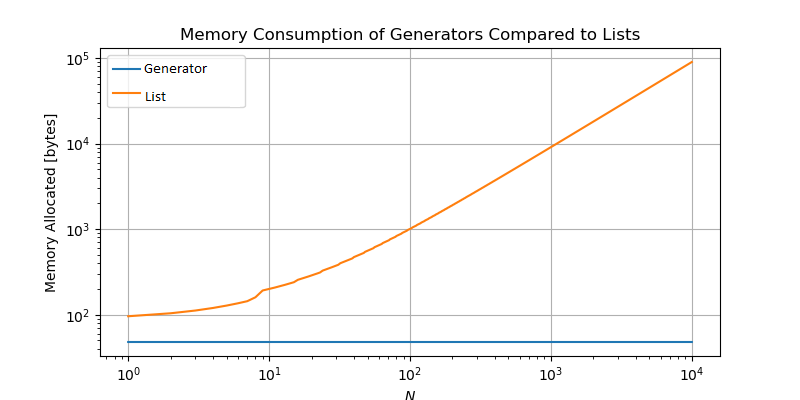

## Table of contents

* [Concept](#concept)
* [Comprehension](#generator-comprehension)
* [Performance](#generator-performance)
* [Usecases](#usecases)
* [Resources](#resources)
   

## Concept
___________________________________________________________________________________________________

The yield statement suspends the function’s execution and sends a value back to the caller, but 
retains its state so that it can be resumed. When resumed, the function continues execution 
immediately after the last yield run. This allows its code to produce a series of values over 
time, rather than computing them at once and sending them back like a single list.

A generator is a function that can stop whatever it is doing at an arbitrary point in its body, 
return a value back to the caller, and, later on, resume from the point it had `frozen' and 
merrily proceed as if nothing had happened. It produces a sequence of results instead of a 
single value. The other important aspect of generators is that they can be consumed only once 
and cannot be reused.

Example:

    # Subroutine returning a collection object
    def evens(stream):
       them = []
       for n in stream:
          if n % 2 == 0:
             them.append(n)
       return them

    # Generator function which generates a sequence of values
    def evens(stream):
        for n in stream:
            if n % 2 == 0:
                yield n

Generators are a subtype of iterators as they implement the iterator protocol. An iterator 
object stores its current state of iteration and “yields” each of its members in order, 
on-demand via the __next__() method until it is exhausted. 

The __iter()__ method of the iterator protocol can be implemented as a generator. The advantages 
of generators are mainly the reduced memory footprint and the lazy evaluation of an expression. 
Values in generator expressions are calculated only on demand.

Example:

    def infinite_sequence():
        i=0
        while True:
            yield i
            i+=1
    
    gen = infinite_sequence()
    
    print(next(gen))
    >>> 0
    
    print(next(gen))
    >>> 1
    
    print(next(gen))
    >>> 2

### Comprehension

The generator comprehension is a short syntax for a simple generator function. In the generic 
syntax of generator comprehensions <expression> is any single line of Python code returning an 
object.
    
    (<expression> for <var> in <iterable> if <condition>

An example illustrating the syntax above is

     num = (x for x in range(100) if x % 2 == 0)
     for x in num:
          print(x)

which is equivalent to

    def num():
        for x in range(100):
            if x % 2 == 0:
                yield x
    
    num_generator = num()
    for x in num_generator:
        print(x)

Another more complex example

     # Yield "apple" if number is even else yield "pie"
     generator = (("apple" if i % 2 == 0 else "pie") for i in range(6))
     for x in generator:
          print(x)

     # Output:
     # -------
     # apple
     # pie
     # apple
     # pie
     # apple
     # pie

In the generic syntax of generator comrehensions `<expression>` is any single line of Python code returning an object.

### Performance

Generators are used mainly for memory efficiency but at the cost of increased complexity and overhead required to 
save the current state of the generator function.

## Usecases
_______________________________________________________________________________________________________________________

1. Increased readability
2. Infinite sequences
3. Reduced memory

See `os.path.walk()` vs `os.walk()`

## Exercises

1. Write an infinite counter generator using the generator API
2. Write a program to compare memory size of list and generator comprehensions
3. Write a generator which calculates fibonacci numbers up to a given limit
4. Write a city ranking generator with delegation (split in city and limit generators)
5. Write a recursive odd number generator

## Resources
_______________________________________________________________________________________________________________________

* <https://www.python-course.eu/python3_generators.php>
* <https://www.youtube.com/watch?v=EnSu9hHGq5o>
* <https://www.python.org/dev/peps/pep-0255>
* <https://www.pythonlikeyoumeanit.com/Module2_EssentialsOfPython/Generators_and_Comprehensions.html>