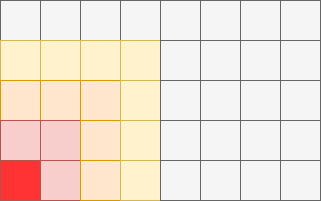

# Why using classes and objects?

The object oriented programming offers a way to solve problems which can be require a state and
a definition of relationships. 

For example one classical problem is to write a program that must calculate how the temperature is
propagated when we heat an object.


The longer we keep the heating process the more the object will get heated until a certain 
temperature is reached. The heating is not instanious but a gradual process, with a heat wave
propagating through the material of the object. The material itself determines how quick the final
temperature will be reached.



One solution would be to write a function which will iterate through all the elements in the table
and calculate the momentary state for each element.

```
# Matrix with all the elements
table = [ ... ]

def calc_temp_propagation(table):
    
    for row
        
    

```

# What is a class?

Classes are instructions on how to build an object. They answer the following questions:

What does the object HAVE as parts? (HAVE WHAT?)
What does the object DO? (DO WHAT?)

Example:

A person has a name and age
A person sleeps, eats, and breaths

Classes are actually custom types. By creating a new class we define also a new type and define 
what to do with it.


```python

class Python(object):
    
    def __init__(self, name, age):
       self.name = name
       self.age = age
       
    def sleep(self):
        print("{0} sleeping...".format(self.name))

    def eat(self):
        print("{0} eating...".format(self.name))
             
```

# What is an instance of a class?

The instance is the object after its construction using the class. Each instance is uniquely
identifiable and exists separately from other instances.

Example:

- Branimir Georgiev is 40 years old
- Dimitar Ivanov is 45 years old

The construction of the instance is as simple as defining a variable and then assigning it to 
the constructor. The default constructor is the class name with parenthesis.

Example:

```python

class Python(object):
    
    def __init__(self, name="Nemo", age=0):
       self.name = name
       self.age = age
       
    def sleep(self):
        print("{0} sleeping...".format(self.name))

    def eat(self):
        print("{0} eating...".format(self.name))

        

default = Person()
p1 = Person(name='Branimir', age=40)
p2 = Person(name='Dimitar', age=18)

```

# What is an instance variable?

Instance variables make up the composition of the object and define the parts of the object. 
Instance variables are also called properties.

> WHAT does the instance HAVE? (HAVE WHAT?)

Example:

```python

class Python(object):
    
    def __init__(name="Nemo", age=0):
       self.name = name
       self.age = age
       
    def sleep(self):
        print("{0} sleeping...".format(self.name))

    def eat(self):
        print("{0} eating...".format(self.name))

        
p = Person(name='Branimir', age=40)
print(p.name)
print(p.age)

```

# What is an instance method?

An instance method is a function, which belong only to the instances of a class. Instance 
methods can only be used when the instance of the class has been created.

> WHAT does the instance DO? (DO WHAT?)
 
Example:

```python

class Python(object):
    
    def __init__(self, name="Nemo", age=0):
       self.name = name
       self.age = age
       
    def sleep(self):
        print("{0} sleeping...".format(self.name))

    def eat(self):
        print("{0} eating...".format(self.name))
        

p = Person(name='Branimir', age=40)
p.sleep()
p.eat()

```

# What is inheritance?

Inheritance is a way to transfer class members from a parent class to a child class. The child 
class can override or extend the parent members. The relationship the inheritance represent is a 
**"IS A"** relationship.

Example:

    Specialization --------> Generalization
    A Student is a Person and a Person is an Object.

```python

class Person(object):
    def __init__(self, name="Nemo", age=0):
        self.name = name
        self.age = age

    def sleep(self):
        print("{0} sleeping...".format(self.name))

    def eat(self):
        print("{0} eating...".format(self.name))


class Student(Person):

    def sleep(self):
        print("{0} sleeping for 4 hours ...".format(self.name))

    def study(self):
        print("{0} studying...".format(self.name))


p = Student(name='Branimir', age=40)
p.sleep()
p.eat()
p.study()

```

The direction from the parent to the child is called specialization. The 
opposite direction is called generalization or abstraction.


# What is a constructor?

Classes define objects and we can create many instances by using a constructor. The constructor 
is like a factory, which allocates the needed resources to create the object.

Example:

```python

class Person(object):
    def __init__(self, name="Nemo", age=0):
        self.name = name
        self.age = age

    def sleep(self):
        print("{0} sleeping...".format(self.name))

    def eat(self):
        print("{0} eating...".format(self.name))

p = Person()
print(p.name, p.age)

```

Constructors are special methods inside a class, which are responsible for the initialization of 
the instance variables. Typically when a new instance is created, Python will call first 
`__new__` and then `__init__`.

The method `__new__` is used to control how a new instance is created. Tbe method `__init__` 
determines how the instance variables are initialized.

```python

class Person(object):

    def __new__(cls, *args):
        print("__new__ called")
        return object.__new__(cls)

    def __init__(self):
        print("__init__ called")

d = Person()

```

A simple usecase for `__new__` is when trying to guarantee that only one instance of the class 
will be created.

```python

class Singleton(object):

    __instance = None
    
    def __new__(cls):
        if cls.__instance is None:
            print("creating...")
            cls.__instance = object.__new__(cls)
        return cls.__instance

s1 = Singleton()
s2 = Singleton()

print(s1)
print(s2)
```

Or simply using `__new__` to return a specific class depending on the confiruation of the parent 
class.

```python

class Animal(object):
    def __new__(cls, legs):
        if legs == 2:
            return Biped()
        else:
            return Quadruped()


class Biped(object):
    def __init__(self):
        print("Initializing 2-legged animal")


class Quadruped(object):
    def __init__(self):
        print("Initializing 4-legged animal")


anim1 = Animal(legs=4)
anim2 = Animal(legs=2)

```

# What are getters and setters?

The getters and setters are special methods, which can be used as if they are properties. Getters 
and setters are used  mainly in two scenarios:

1. To allow to use method as if they are properties
2. To perform a conversion or check before using the property
3. To encapsulate the internal state of the object from external modification

```python

class Person(object):
    
    def __init__(self, name="Nemo"):

        # Protect the internal object state by making it protected
        self.__name = name

    @property
    def name(self):
        print("Getter called...")
        return self.__name

    @name.setter
    def name(self, value):
        print("Setter called...")
        if len(value) > 255:
            print("Maximum name length is 255 symbols...")
        else:
            self.__name = value


# Get property value
p = Person()
print(p.name)
print("")

# Set the property value
p.name = 'Branimir'
print(p.name)
print("")

# Check and protect the property value
p.name = '*' * 256
print(p.name)
print("")

```

# What is a super class?

The super class is the parent with all its properties and methods. In some scenarios the child 
class might require to access the super class constructors or its methods. In Python the access 
to the parent class is enabled with the `super()`.


# What are class variables?

Class variables don't belong to a specific instance, they can be accessed
by all instances. Usually useful to define constants available to all
instances of the class.

> WHAT does the class HAVE?

Example:

A doctor is a person, who can operate (specialization) and all doctors
have the Hippocratic Oath.

# What are class methods?

Class methods like class variables are not bound to the instance but to the class itself.

> WHAT does the class DO? (DO WHAT?) *

Class methods are usually used to:

1. Manipulate class variables
2. Encapsulate methods in a namespace

Example:

    Math.abs(x)
    Math.sin(x)
    Math.cos(x)


# What are private and protected variables and classes?

- protected variables and classes can be accessed within the same package
- private variables and classes can be accessed only within inside the class


    TODO: Examples

# What are abstract classes?

Abstract classes are special type of classes used to define an set of methods with missing or 
partial implementation. Abstract classes are used mainly as templates for other classes. This 
way a program might use the interface of the abstract class without being aware of the concrete
implementations.

> "What the subclass MUST HAVE AND DO?"


# What are interfaces?

Interfaces are special type of abstract classes, whose methods MUST be
overridden by the inheriting class. A given class can have many
interfaces in contrast to abstract classes, which can be inherited only
once.

Notes
- A class can have many interfaces
- All of the members MUST be overridden

# What are mixins?

Mixins are used to group functionality into logical groups and add it to
classes which require it. It basically solves the problem with exploding
hierarchy. They are like LEGO pieces, which can be used in many places.

Example:

- A Server has keyboard, mouse, display
- A Computer has keyboard, mouse, display and sound
- A Tablet has display and sound
 
Separate components as mixins and used them whenever required.

Mixins don't have constructors and cannot be instantiated. They operate in  the same namespace 
of the calling class. This means that all variables and methods combined MUST have unique 
names in order to  avoid name collisions.

Example:

    class A(object):
        test = false;

    class B(object)
        test = true;


    class C(A, B):
        pass
 

The calling class sees test as one variable and will have the last value assigned to it.
 
# What is an extension?

Extensions add new functionality into existing classes. The classes are not aware of the extensions
as they are not modified. Extensions are very useful for modifying build-in classes.

Comparison:
- Mixin      : Class is aware of the mixin
- Extension  : Class is not aware of the extension


# What is the object class?

The object class is the root of all classes. New classes inherit form Object by default. It has 
several useful methods, which can be overridden and which affect how the object is represented 
and compared.

Important features:

- Hash code to uniquely identify the object
- Method for the object representation
- Equality operator

The method __str__ provides the human friendly representation of the class. The new class can 
override it to give more information about the object.

The __hash__ getter is a hash value returned from a hash function. Hash functions take arbitrary 
sizes and convert them to a data set of a fixed size. A small change in the input data set leads 
to a big change in the output data set. This is why they are used to identify objects. To
objects are considered equal if they have the same hash code.
