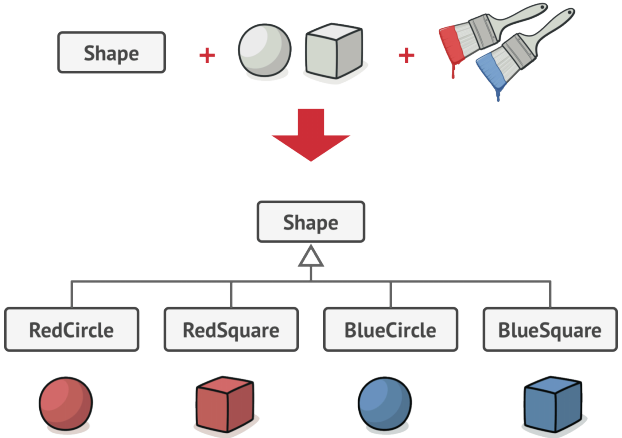
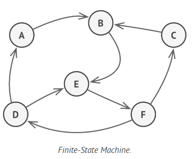

= PART B: Advanced Python
:doctype: book
:sectnums:
:docinfo:
:toc:

== Requirements

=== Python Installation

- https://www.python.org/downloads[Python 3.7 or higher] (*_recommended_*)
- https://www.python.org/downloads/release/python-2718[Python 2.7.18]

=== Python IDE

- https://www.jetbrains.com/pycharm/[PyCharm] (*_recommended_*)
- https://code.visualstudio.com/[Visual Studio Code]

=== Version Control

- https://git-scm.com/[Git Client] (*_recommended_*)
- https://github.com[GitHub Account] (*_recommended_*)
- https://tortoisesvn.net/[SVN Client]

=== Style Guide

- https://peps.python.org/pep-0008/[PEP-08] (*_mandatory_*)
- https://google.github.io/styleguide/pyguide.html[Google Style Guide] (*_mandatory_*)

== OOP Principles

Object-oriented programming is a programming paradigm of organizing the software around objects that can contain data.
It is based on four major principles: abstraction, inheritance, encapsulation, polymorphism.

=== Abstraction (Modeling)

Abstraction is a fundamental concept in object-oriented programming (OOP) that refers to the
process of exposing only the relevant and essential data and behavior to the users without
showing the internal implementation details. It is used to manage complexity and reduce
dependencies between classes.

Now let's look at an example of abstraction in Python. Let's say you want to model a person. You
look around you and see that each person is unique, e.g. name, age, height, weight, etc. However,
there are some common characteristics that all people share, e.g. they can walk, talk, eat, etc.
You can use abstraction to model a person by focusing on the common characteristics and ignoring
the unique characteristics.

In abstract terms, a person is an object that has a name, an age, a height, a weight, etc. It can
walk, talk, eat, etc. The name, age, height, weight, etc. are the attributes of the person. The
walk, talk, eat, etc. are the methods of the person. The attributes and methods of a person are
called the interface of the person. The interface of a person defines the ways in which you can
interact with a person.

In complex software development abstraction is achieved by using **abstract classes** or
**interfaces**. The latter is not available in Python but can be emulated using abstract classes
with abstract methods only.

They key points about abstraction are:

- Focuses on the "what an object does" rather than "how it does it"
- Allows you to define a clear and high-level interface for interacting with objects
- Uses abstract classes or interfaces provide a blueprint for other classes to follow
- Manages complexity and enhances code readability

[source,python]
----
include::02_oop/examples/abstraction.py[]
----

=== Inheritance (Code Reuse)

Inheritance is the process of creating a new class from an existing class. The subclass inherits
the attributes and methods of the superclass and can add its own attributes and methods.
The inheritance is the opposite process of abstraction and is used to represent an _is-a_ relationship,
e.g a student is a person.

Key points about inheritance:

- Reuses code from an existing class
- Represents an _is-a_ relationship
- Focuses on the "what" an object is and how it behaves

[source,python]
----
include::02_oop/examples/inheritance.py[]
----

=== Encapsulation (Data Hiding)

This is a fundamental concept in object-oriented programming (OOP) that refers to the hiding of
data through the use of access modifiers and special methods called getters and setters. It is
used to protect the internal state of an object from the outside world.

Python offers no mechanism for making attributes private and relies on naming conventions to
distinguish between public, protected and private attributes. Protected attributes are prefixed with a single
underscore and private attributes are prefixed with a double underscore.

Key points about encapsulation:

- Uses access modifiers to hide the internal state of an object
- Provides getters and setters to access and modify the internal state of an object
- Defines protection logic for invalid values in the setters

[source,python]
----
include::02_oop/examples/encapsulation.py[]
----

*Public* attributes and methods are accessible from outside the class. They are used to define the
interface of the class. Typcially all getter and setter methods are public. Public attributes and
methods are not prefixed with an underscore.

*Protected* attributes and methods are accessible from outside the class but only in a subclass. They
may or may not have a getter or setter method. Protected attributes and methods are prefixed with
a single underscore.

*Private* attributes and methods are not accessible from outside the class. They are used to hide the
internal implementation details of a class. Private attributes and methods are prefixed with a
double underscore.

[source,python]
----
include::02_oop/examples/access_modifiers.py[]
----

=== Polymorphism (Flexibility)

*Polymorphism* is the ability of an object to take on many forms. It is used to represent an _is-a_
relationship. Polymorphism is achieved by using inheritance and overriding or overloading the
methods of the superclass.

*Overriding* is the process of redefining a method in the subclass. The method in the subclass has
the same name and signature as the method in the superclass.

*Overloading* is the process of defining multiple methods with the same name but different
signatures in the same class.

[source,python]
----
include::02_oop/examples/polymorphism.py[]
----

=== Association (Relationships)

Association represents a relationship between classes. It describes how objects from different
classes interact and collaborate to achieve a certain functionality. Associations define the ways
in which objects can relate to each other and exchange information.

Associations may have also have a direction. For example, a car has an engine, but an engine does
not have a car. This is a unidirectional association. Possible directions for associations are:

- non-directional
- uni-directional
- bi-directional

Associations may also have a multiplicity. For example, a car has one engine, but an engine may
belong multiple cars. In this case, the association is one-to-many. Possible multiplicities for
associations are:

- one-to-one
- one-to-many
- many-to-many

Key points about associations:

- Defines the ways in which objects can relate to each other and exchange information
- May have a direction (non-directional, uni-directional, bi-directional)
- May have a multiplicity (one-to-one, one-to-many, many-to-many)

==== Dependency
Dependency is a relationship between two classes in which one class depends on the other. It is
used to represent a "uses-a" relationship. For example a car can be ignited only if the owner has
the right key. In abstract terms the key is the interface and if its implementation is changed
then the car will not be able to start.

Key points about dependency:

- "Uses-A" Relationship
- Unidirectional
- Weak Coupling
- Short Lifetime

==== Composition
Composition allows you to build complex objects by combining simpler objects. It involves
creating a class that contains one or more objects of other classes as its members. In
composition, the containing class is responsible for creating and managing the objects it
contains, and it can delegate certain responsibilities to those contained objects.

While both composition and inheritance facilitate code reuse, composition is often preferred over
inheritance when you want to avoid tight coupling between classes or when the "is-a" relationship
isn't appropriate. Composition offers more flexibility and allows you to create more maintainable
code in complex scenarios.

Key points about composition:

- "Has-A", "Composed-Of" Relationship
- Delegate Responsibilities (the whole delegates responsibilities to the parts)
- Strong Coupling (the whole is responsible for the parts)
- Single Ownership (if the whole is destroyed, the parts are destroyed)
- Shared Lifetime (if one part is destroyed, the whole is destroyed)

==== Aggregation

Aggregation is another concept in object-oriented programming (OOP) that involves a "whole-part"
relationship between classes. It's a form of association where one class represents a larger
structure (the whole), and it contains or is composed of other classes (the parts). Aggregation
is a more specialized form of composition, emphasizing a looser relationship between the whole
and its parts.

While both aggregation and composition involve relationships between classes, composition implies
a stronger relationship, where the contained objects are owned and managed by the containing
object. Aggregation, on the other hand, represents a looser relationship where the parts can
exist independently.

- "Has-A" Relationship
- Delegate Responsibilities (the whole delegates responsibilities to the parts)
- Looser Coupling (the whole is not responsible for the parts)
- Shared Ownership (if the whole is destroyed, the parts are not destroyed)
- Independent Lifetimes (if one part is destroyed, the whole is not destroyed)

== SOLID Design

The SOLID principles are a set of design principles for software development that aim to improve
the quality of software by making it more maintainable, flexible, understandable and scalable.
They were introduced by Robert C. Martin (Uncle Bob) in his 2000 paper, "Design Principles and
Design Patterns". The SOLID acronym was introduced later by Michael Feathers.

The SOLID principles are:

- Single Responsibility Principle (focus one thing at a time)
- Open/Closed Principle (extend instead of modify)
- Liskov Substitution Principle (children shall not break on using parents behavior)
- Interface Segregation Principle (many small interfaces are better than one big interface)
- Dependency Inversion Principle (depend on abstract interfaces, not on concrete objects)

=== Single Responsibility Principle

The single responsibility principle states that a class or function should have a single reason
to change. In simpler terms, it should do one job and do it well.

Despite being one of the easiest principles to understand, the single responsibility principle is
also one of the most difficult to apply. The reason for this is that it is not always clear what
constitutes a single responsibility and how feasible it is to split a class or function into
several classes or functions.

*Example: Breaking the single responsibility principle*

This is a simple example of a class that violates the single responsibility principle. The class
too many responsibilities and a change might break the code that uses it. For example, if you
change the data format from JSON to XML, you will have to modify the class to handle the new data
format. This is a clear violation of the single responsibility principle.

[source,python]
----
include::03_solid/examples/single_responsibility_bad.py[]
----

*Example: Following the single responsibility principle*

This is am implementation of the single responsibility principle. The class has been split
into three classes, one for reading data from a file, one for processing the data, and one for
writing the data to a file. This way, each class has a single responsibility and a change will
not break the code that uses it. This way we can easily read from a file, process the data, and
write the data to another file.

[source,python]
----
include::03_solid/examples/single_responsibility_good.py[]
----

=== Open/Closed Principle

A module, class or function should be open for extension but closed for modification. This means
that a module, class or function should be extendable without having to modify its source code,
except in cases where you need to fix bugs.

In Python, you can use inheritance and composition to achieve this principle. This can be achiieved
through:

- Composition (adding new functionality through composition)
- Subclassing and Polymorphism (extending existing functionality of a parent class)
- Mixins (adding new functionality to a class through multiple inheritance)
- Monkey patching (adding new functionality at runtime)

*Example: Breaking the open/closed principle*
[source,python]
----
include::03_solid/examples/open_closed_bad.py[]
----

*Example: Following the open/closed principle*
[source,python]
----
include::03_solid/examples/open_closed_good.py[]
----

=== Liskov Substitution Principle

In simple words this principle states that children shall not break on using parents behavior.
If you have a class hierarchy, then you should be able to use any subclass in place of its parent
class without any unexpected behavior. If this is not the case, then you are violating the Liskov
substitution principle.

A very common example of violating this principle is when a subclass overrides a method of its
parent class to do nothing. Or when the method has to check the type of an object to determine
what to do with it.

The Liskov substitution is used to ensure that class hierarchies are well designed and to prevent
unexpected behavior when using polymorphism. Some bad examples of violating this principle are:

- Override a method of a base class to do nothing
- Overriden methods change their behavior (e.g. return type, arguments, exceptions, etc.)
- The parent or the child has to check the type of an object to determine what to do with it

*Example: Violating the Liskov substitution principle*
[source,python]
----
include::03_solid/examples/liskov_substitution_bad.py[]
----

*Example: Following the Liskov substitution principle*
[source,python]
----
include::03_solid/examples/liskov_substitution_good.py[]
----

=== Interface Segregation Principle

The interface segregation principle states that many small interfaces are better than one big
interface. This means that a class should not be forced to implement methods that it does not
need.

This principles is applied when a class has many subtypes and sometimes only a few of them need to
use a particular method. In this case, it is better to split the interface into several smaller
interfaces so that each subtype only implements the methods that it needs.

Let's say we have an abstract class for a vehicle that has a method for driving and a method for
flying. We also have a class for a car that implements the driving method and a class for a plane
that implements the flying method. This is a clear violation of the interface segregation principle
because the car class does not need to implement the flying method and the plane class does not
need to implement the driving method.

In this case, it is better to split the vehicle interface into two smaller interfaces, one for
driving and one for flying. This way, the car class only needs to implement the driving interface
and the plane class only needs to implement the flying interface.

Some common examples of violating this principle are:

- A class implements a large number of methods that are not used by all subtypes
- A class has many abstract methods that are shall not be implemented by all subtypes

*Example: Violating the interface segregation principle*

[source,python]
----
include::03_solid/examples/interface_segregation_bad.py[]
----

*Example: Following the interface segregation principle*

[source,python]
----
include::03_solid/examples/interface_segregation_good.py[]
----

=== Dependency Inversion Principle

High-level modules should not depend on low-level modules. Both should depend on abstractions.
Abstractions should not depend on details. Details should depend on abstractions. The dependency
inversion principle is used to decouple high-level modules from low-level modules. It is used to
reduce the coupling between modules and to make them more reusable. It is also used to make modules
more testable.

As an example, let's say you have a class that depends on a database. You can decouple the two
classes by using an interface or an abstract class to access the database. The concrete
implementation will be injected with a constructor or a setter method. This way, the two classes
are decoupled from each other and can be used independently.

*Example: Violating the dependency inversion principle*

[source,python]
----
include::03_solid/examples/dependency_inversion_bad.py[]
----

*Example: Following the dependency inversion principle*

[source,python]
----
include::03_solid/examples/dependency_inversion_good.py[]
----

== Design Patterns

=== Creational Patterns

The creational patterns are a set of design patterns that deal with the creation of objects. They
are used to create objects in a systematic way that promotes reusability and flexibility. The
creational patterns are:

- Factory Method
- Abstract Factory
- Builder
- Prototype
- Singleton

==== Factory Method

The factory method pattern is a creational pattern that uses factory methods to create objects.
A factory method is a method that returns an object of a class and can be called at runtime. It
provides a way to hide the creation logic of an object. In Python the factory method is usually
implemented as a static method or a class method.

[source,python]
----
include::04_patterns/examples/factory_static_method.py[]
----

[source,python]
----
include::04_patterns/examples/factory_class_method.py[]
----

==== Abstract Factory

The abstract factory pattern is a creational pattern that extends the factory method pattern. It
is an abstract class that provides an interface consisting of a set of factory methods for creating
objects that are somehow related. The methods themselves are abstract and are specified to return
abstract objects.

[source,python]
----
include::04_patterns/examples/abstract_factory.py[]
----

==== Builder

The builder pattern is a creational pattern that is used to create complex objects. It provides a
way to create an object step by step and allows you to produce different types and
representations of an object using the same construction code.

In Python the builder pattern is usually implemented using a class with a **_fluent_
_interface_**. A fluent interface is an object-oriented API that aims to provide more readable code.

Typically it involves method chaining and replaces multi-parameter functions, such as complex
constructors, with multiple methods that each take a single parameter.

[source,python]
----
# Complex constructor
person = Person(
    age = 40,
    name = "John Doe",
)

# Builder with fluent interface
person = Person().name("John Doe").age(40)
----

It is implemented by using method chaining to invoke multiple methods on the same object. The
methods return the object itself which allows the calls to be chained together in a single
statement.

[source,python]
----
include::04_patterns/examples/builder.py[]
----

==== Prototype
The prototype pattern is a creational pattern that is used to create objects by cloning existing
objects. The new object will have the same properties as the cloned object but will be a separate
instance. It provides a way to hide the creation logic of an object.

In Python the prototype may be implemented using the copy module or the `copy()` and `deepcopy()`
methods. The `copy()` method creates a shallow copy of an object. A *shallow copy* of an object is a
copy of the object without cloning any of its internal references. The deepcopy() method creates a
deep copy of an object. A *deep copy* of an object is a copy of the object that clones all of its
internal references.

For simplicity the following example will not use the copy methods and instead will show the logic of the
prototype pattern.

[source,python]
----
include::04_patterns/examples/prototype.py[]
----

==== Singleton
The singleton pattern is a creational pattern that is used to create a single instance of a class.
It provides a way to hide the creation logic of an object.

In Python the singleton pattern can be implemented in many ways, for example by using the __new__
method.

[source,python]
----
include::04_patterns/examples/singleton.py[]
----

=== Structural Patterns

Structural patterns are a set of design patterns that deal with the composition of classes and
objects. They are used to create larger structures from smaller ones. The structural patterns are:

- Adapter
- Bridge
- Composite
- Decorator
- Facade
- Flyweight
- Proxy

==== Adapter

The adapter pattern is a structural pattern that is used to adapt the interface of a class to
another interface. It provides a way to hide the incompatibility between two interfaces.  The
adapter pattern is also called the wrapper pattern.

There are two types of adapters:

- Class adapter
- Object adapter

The class adapter uses multiple inheritance to adapt one interface to another. It is implemented
by creating a subclass of the target class and the adaptee class. The subclass inherits the target
class and the adaptee class. It provides a way to adapt the interface of the adaptee class to the
interface of the target class.

The object adapter uses composition to adapt one interface to another. It is implemented by
creating a class that contains an instance of the adaptee class. It provides a way to adapt the
interface of the adaptee class to the interface of the target class.

[source,python]
----
include::04_patterns/examples/adapter_with_inheritance.py[]
----

[source,python]
----
include::04_patterns/examples/adapter_with_composition.py[]
----

==== Bridge

The bridge pattern provides a way to hide the implementation details of a class from the clients
using it. It is used to decouple an abstraction from its implementation so that the two can vary
independently. It provides a way to separate the interface of a class from its implementation.

Let's say you have a class that can draw shapes with different colors. You can implement this
class by using inheritance. You can create a subclass for each shape and color combination. For
example, you can create a subclass for drawing a red circle, a red square, a blue circle, and a
blue square. This approach works well if you have a small number of shapes and colors. However, it
becomes difficult to manage when you have a large number of shapes and colors.

The bridge pattern can be used to solve this problem. It provides a way to separate the interface
of a class from its implementation. It allows you to create a class that can draw shapes with
different colors without having to create a subclass for each shape and color combination.

image::04_patterns/assets/shapes_and_colors_with_composition.png[]

[source,python]
----
include::04_patterns/examples/bridge.py[]
----

==== Composite

The composite pattern is a structural pattern that is used to compose objects into tree structures
to represent part-whole hierarchies. It provides a way to treat both individual objects and groups
of objects in a uniform way. It is used to create a tree structure of objects where each node in
the tree structure can be either an individual object or a group of objects.

[source,python]
----
include::04_patterns/examples/composite.py[]
----

==== Decorator

The decorator pattern is a structural pattern that is used to add new functionality to an existing
object without changing its structure. It provides a way to extend the functionality of an object
at runtime.

[source,python]
----
include::04_patterns/examples/decorator.py[]
----

==== Facade

The facade pattern is a structural pattern that is used to create a simplified
interface to a complex system. It provides a way to hide the complexity of a system and provide
clients with a simple interface to it.

[source,python]
----
include::04_patterns/examples/facade.py[]
----

==== Flyweight

The Flyweight Pattern is a structural design pattern that's used to minimize memory usage or
computational expenses by sharing as much as possible with related objects. It's especially
useful when you have a large number of similar objects that can be made more efficient by sharing
common state.

The shared state is immutable and can be shared between multiple objects. The non-shared state is
mutable and is stored by the flyweight object. The non-shared state must be passed to the flyweight
object by the client when it is needed.

Some typical use cases for the flyweight pattern are:

- Text editors
- Word processors
- eCommerce applications
- Graphics applications
- Computer games

[source, python]
----
include::04_patterns/examples/flyweight.py[]
----

==== Proxy
The proxy pattern is a structural pattern that is used to provide a surrogate or placeholder for
another object to control access to it. It provides a way to add extra functionality to an object
without changing its structure.

[source,python]
----
include::04_patterns/examples/proxy.py[]
----

=== Behavioral Patterns

Behavioral patterns are a set of design patterns that deal with the communication between classes
and objects. They are used to define how objects interact with each other. The behavioral patterns
are:

- Chain of Responsibility
- Command
- Interpreter
- Iterator
- Mediator
- Memento
- Observer
- State
- Strategy
- Template Method
- Visitor

==== Chain of Responsibility

The Chain of Responsibility is a behavioral design pattern that allows you to pass requests along
a chain of handlers. Each handler decides either to process the request or to pass it to the
next handler in the chain. Here's a simple example of the Chain of Responsibility pattern in
Python:

Let's say we have a purchase approval system where purchase requests are handled by different
managers based on the amount. If the purchase amount is below a certain threshold, a team leader
can approve it. If it's above the team leader's limit, it's passed to a manager, and so on.

When to use the chain of responsibility pattern:

- Execute multiple handlers in a specific order
- Change the set or the order of the handlers at runtime

[source,python]
----
include::04_patterns/examples/chain_of_responsibility.py[]
----

==== Command

The command pattern is a behavioral pattern that is used to encapsulate a request as an object.
It provides a way to decouple the sender of a request from its receiver by giving multiple objects
a chance to handle the request.

When to use the command pattern:

- Parametrize objects with operations
- Specify, queue, and execute requests at different times
- Support reversible operations

[source, python]
----
include::04_patterns/examples/command.py[]
----

==== Iterator

The Iterator Pattern is a behavioral design pattern that allows sequential access to the elements
of an composite object without exposing its underlying representation. The composite object may be
a list, a tree, a graph or any other complex data structure. The iterator pattern decouples the
algorithm for traversing the data structure from the data structure itself.

Python offers a built-in iterator protocol that allows you to iterate over all the elements of a
any composite object that implements the *__iter__()* method. The __iter__() method should return an
iterator object that implements the *__next__()* method. The *__next__()* method should return
the next element in the sequence (see chapter about dunder methods).

When to use the iterator pattern:

- Access the elements of a composite object sequentially without exposing its underlying
representation
- Provide a uniform interface for traversing different aggregate structures

[source,python]
----
include::04_patterns/examples/iterator.py[]
----

==== Mediator
Mediator is a behavioral design pattern that lets you reduce chaotic dependencies between objects.
The pattern restricts direct communications between the objects and forces them to collaborate
only via a mediator object.

When to use the mediator pattern:

- There are tight interconnections between several components
- Use when it gets hard to maintain relationships between multiple objects
- A component becomes hard to reuse in a different context

[source,python]
----
include::04_patterns/examples/mediator.py[]
----

==== Memento

The Memento Pattern is a behavioral design pattern that allows you to save and restore the previous
state of an object without revealing the details of its implementation. It provides a way to save
the internal state of an object without violating encapsulation. The pattern is also knows as the
snapshot pattern.

When to use the memento pattern:

- Produce snapshots of an object's state to be able to restore it later
- Use when direct access to the object's fields/getters/setters violates its encapsulation
- Use in combination with the command pattern to implement undoable operations (save,
execute, restore)

[source,python]
----
include::04_patterns/examples/memento.py[]
----

==== Observer
Observer is a behavioral design pattern that lets you define a subscription mechanism to notify
multiple objects about any events that happen to the object they’re observing. The producer of the
events is called the *Subject*. The object that consumes the events is called the *Observer*. The
subject and the observer are loosely coupled.

When to use the observer pattern:

- Use the Observer pattern when changes to the state of one object may require changing other
objects, and the actual set of objects is unknown beforehand or changes dynamically.
- Use the pattern when some objects in your app must observe others, but only for a limited time
or in specific cases.

[source,python]
----
include::04_patterns/examples/observer.py[]
----

==== State
State is a behavioral design pattern that lets an object alter its behavior when its internal
state changes. It appears as if the object changed its class. The pattern encapsulates the states
into separate classes and delegates the state transitions to the objects representing the states.

When to use the state pattern:

- Use the State pattern when you have an object that behaves differently depending on its current
state, the number of states is enormous, and the state-specific code changes frequently.
- Use the pattern when you have a class polluted with massive conditionals that alter how the class
should behave according to the current values of the class’s fields.
- Use the pattern when you have a lot of duplicate code across similar states and transitions of a
condition-based state machine.

[source,python]
----
include::04_patterns/examples/state.py[]
----

==== Strategy
Strategy is a behavioral design pattern that lets you define a family of algorithms, put each of
them into a separate class, and make their objects interchangeable.

When to use the strategy pattern:

- Use the Strategy pattern when you want to use different variants of an algorithm within an
object and be able to switch from one algorithm to another during runtime.
- Use the pattern when your class has a massive conditional operator that switches between
different variants of the same algorithm.
- Use the pattern when you have a lot of similar classes that only differ in the way they execute
some behavior.

[source,python]
----
include::04_patterns/examples/strategy.py[]
----

==== Template Method
Template Method is a behavioral design pattern that defines the skeleton of an algorithm in the
superclass but lets subclasses override specific steps of the algorithm without changing its
structure.

When to use the template method pattern:

- Use the Template Method pattern when you want to let clients extend only particular steps of an
algorithm, but not the whole algorithm or its structure.
- Use the pattern when you have several classes that contain almost identical algorithms with
some minor differences. As a result, you might need to modify both classes when the algorithm changes.

[source,python]
----
include::04_patterns/examples/template_method.py[]
----

==== Visitor

The Visitor Pattern is a behavioral design pattern that allows you to separate algorithms from
the objects on which they operate. It provides a way to add new operations to existing classes
without modifying them. This pattern is especially useful when you have a complex structure of
objects and want to perform various operations on them without modifying their source code.

When to use the visitor pattern:

- Use the Visitor pattern when you need to perform an operation on all elements of a complex object
structure (for example, an object tree).
- Use the Visitor to clean up the business logic of auxiliary behaviors.
- Use the pattern when a behavior makes sense only in some classes of a class hierarchy, but not
in others.

[source,python]
----
include::04_patterns/examples/visitor.py[]
----

==== Interpreter

The Interpreter Pattern is a behavioral design pattern that defines a language grammar and
provides an interpreter to interpret sentences in that language. It is often used when you have
a domain-specific language (DSL) and you want to implement an interpreter to execute statements
in that language.

When to use the interpreter pattern:

- Define a grammar for a simple language
- Implement an interpreter for this language

[source,python]
----
include::04_patterns/examples/interpreter.py[]
----

== Software Development

The Software Architecture defines the framework on how to manage the software development process
and organize the software system. It provides a set of guidelines and best practices for building
and maintaining the software system.

Here is a typical set of architectural artifacts that are used to define the software architecture
of a software system:

. Development Environment (e.g version control, issue tracking, CI/CD, IDE, etc.)
. Deployment Strategy (e.g. Standalone, Cloud, etc.)
. Functional Requirements (Use Cases, User Stories, Components, Class Diagrams, etc.)
. Non-Functional Requirements (e.g. Performance, Scalability, etc.)
. Architectural Style (e.g. Monolithic, Microservices, etc.)
- Development Process (e.g. Waterfall, Agile, etc.)
. Quality Assurance (Test Automation)

=== Development Environment

The development infrastructure is the set of tools and processes that are used to develop and
maintain the software system. For example a web application may use the following tools and
processes:

- Technogies (e.g. Python, Django, PostgreSQL, Redis, etc.)
- Integrated Development Environment (e.g. PyCharm, Eclipse, Github Codespaces)
- Coding standards (e.g. PEP 8, Google Python Style Guide)
- Version control (e.g. Git, SVN, Mercurial)
- Release system (e.g. semantic versioning)
- Issue tracking (e.g. Jira, Github Issues)

=== Deployment Strategy

The deployment and infrastructure are the processes and tools that are used to deploy and run the
software system. This could also define the infrastructure requirements such as the operating
system, the database, the web server, etc. For example a web application may use the following
deployment infrastructure:

- as a standalone application on a server or a virtual machine.
- as a container in a container orchestration platform such as Kubernetes.
- on a cloud platform such as AWS, Azure, or Google Cloud.
- on a serverless platform such as AWS Lambda or Google Cloud Functions.
- continuous integration and continuous deployment (CI/CD) tools

=== Functional Requirements

The functional requirements define the functions and features of the software system. For example
a web application may have the following functional requirements:

- User management (e.g. login, logout, register, forgot password)
- User profile management (e.g. update profile, change password)
- Product management (e.g. list products, add product to cart, checkout)
- Order management (e.g. list orders, cancel order, return order)

=== Non-Functional Requirements

The quality attributes are typically the non-functional requirements of a software system. They
define the quality characteristics of the software system. For example a web application may have
the following quality attributes:

- *Performance*: the responsiveness of the system under various workloads and data volumes (e.g.
response time, throughput, latency, resource usage)

- *Scalability*: the ability of the system to handle increasing workloads and data volumes. Scaling
can be done by adding more resources such as CPU or memory (vertical scaling) or by adding more
instances of the system (horizontal scaling).

- *Security*: the ability of the system to protect data and resources from unauthorized access
(e.g. authentication, authorization, encryption, auditing)

- *Reliability*: the ability of the system to perform its functions under abnormal conditions
(e.g. error handling, fault tolerance, failure recovery)

- *Availability*: the ability of the system to be operational and accessible when needed (e.g.
uptime, downtime, mean time between failures)

- *Maintainability*: the ability of the system to be modified and extended (e.g. loose coupling,
modular design, technical documentation)

- *Usability*: the ability of the system to be used by users (e.g. easy of use, learning curve,
user documentation)

- *Testability*: the ability of the system to be tested frequently and automatically (e.g with
a regression test suite that can be run after each software change)

- *Compatibility*: the ability of the system to be compatible with other systems (e.g. backward
compatibility, forward compatibility)

- *Compliance*: the ability of the system to comply with laws, regulations, and standards (e.g.
GDPR, PCI DSS, HIPAA, ISO 27001)

=== Architecture and Design

The architectural patterns are recurring styles that are used to structure a software system. For
example a web application may use the MVC pattern to structure the frontend, and the microservices
pattern to structure the backend of the application.

==== Architecture Styles

===== Multi-Layered

A multi-layered pattern can be used to structure programs that can be decomposed into groups of subtasks,
each of which is at a particular level of abstraction. Each layer provides services to the next
higher layer.

Typically the layers are organized in a hierarchical manner, with each layer providing services
to the next higher layer. Almost all software applications are multi-layered. The most common
layers are:

- Presentation layer (the frontend layer)
- Application layer (the backend layer)
- Data layer (the data access layer)

Examples:

- Model-View-Controller (MVC)
- Model-View-ViewModel (MVVM)
- Model-View-Presenter (MVP)
- Model-View-Intent (MVI)

Protocols are also a form of multi-layered architecture. The OSI model is a seven-layered model
that describes the different layers of a network protocol stack. The TCP/IP model is a four-layered
model that describes the different layers of the Internet protocol suite.

===== Monolithic

A monolithic architecture is a traditional software architecture where all components and
functionalities of an application are tightly integrated into a single codebase and executed as
a single process.

The process may be further divided into multiple threads. The monolithic architecture is the
traditional architecture used by most software applications. It is the opposite of a distributed
architecture. It is also called a monolithic application or a monolithic kernel.

One of the main advantages of a monolithic architecture is that it is simple to develop, test and
deploy. However, it is difficult to scale and maintain. It is also difficult to adopt
new technologies and programming languages. This means that all of the components must be written
in the same programming language.

Links:

- https://en.wikipedia.org/wiki/Monolithic_application[Monolithic application]
- https://en.wikipedia.org/wiki/Monolithic_kernel[Monolithic kernel]

===== Service-Oriented

A service-oriented architecture can be used to structure programs that can be decomposed into a set
of services that are independently deployable and scalable. Each service is self-contained and
implements a single business capability. This allows each service to be developed, tested, deployed,
scaled and maintained independently, without affecting the other services. Each service can be
implemented using a different programming language and technology stack.

Services communicate with each other using a protocol such as HTTP/HTTPS or gRPC. Services can be
deployed as containers in a container orchestration platform such as Kubernetes. Microservices
are typically implemented using a framework such as Spring Boot.

The https://microservices.io/[microservices.io] website provides a good overview of microservices.

Examples:

- https://spring.io/projects/spring-boot[Spring Boot]
- https://quarkus.io/[Quarkus]
- https://micronaut.io/[Micronaut]
- https://helidon.io/[Helidon]
- https://www.mulesoft.com/platform/mule[MuleSoft]
- https://www.ibm.com/cloud/microservices[IBM Cloud Microservices]
- https://www.redhat.com/en/technologies/jboss-middleware/microservices[Red Hat JBoss Middleware]
- https://www.nginx.com/products/nginx/kubernetes-ingress-controller/[NGINX Kubernetes Ingress Controller]

===== Client-Server

This pattern can be used to structure programs that can be decomposed into two parts: a server
that provides a service, and a client that requests services from the server. The client and
server communicate with each other using a dedicated protocol. The client and server may be
implemented using different programming languages and technology stacks.

Examples:

- Web service (HTTP/HTTPS)
- Remote procedure call (RPC)

===== Peer-to-Peer

This pattern can be used to structure programs that can be decomposed into a set of peers
that are symmetric in terms of their functionality, and each peer may act as both a client
and a server. Blockchains or torrents are examples of peer-to-peer networks.

Examples:

- Blockchain
- BitTorrent

===== Pipe-Filter

This pattern can be used to structure programs that can be decomposed into a set of filters that
process a stream of data, and a set of pipes that connect the filters together. Each filter has a
single input and a single output. Pipes can be used to connect the filters together and to
connect a filter to a data source or data sink. This allows the filters to be developed, tested,
deployed, scaled and maintained independently, without affecting each other.

Examples:

- https://en.wikipedia.org/wiki/Pipeline_(Unix)[Unix pipelines]
- https://beam.apache.org/documentation/programming-guide/[Apache Beam]

===== Publish-Subscribe

This pattern can be used to structure programs that can be decomposed into a set of publishers
and subscribers that communicate with each other using a message broker. Publishers publish events
to the message broker, and subscribers subscribe to events of interest to them. The message broker
acts as an intermediary between publishers and subscribers.

Examples:

- https://kafka.apache.org/[Apache Kafka] (event streaming platform)
- https://pulsar.apache.org/[Apache Pulsar] (event streaming platform)
- https://www.confluent.io/[Confluent] (event streaming platform)
- https://nats.io/[NATS] (event streaming platform)
- https://www.rabbitmq.com/[RabbitMQ] (message broker)
- https://mosquitto.org/[Mosquitto] (message broker)
- https://zeromq.org/[ZeroMQ] (messaging library)
- https://redis.io/[Redis] (in-memory data structure store)

Links:

- https://en.wikipedia.org/wiki/Event_loop[Event loop]
- https://en.wikipedia.org/wiki/Event-driven_architecture[Event-driven architecture]
- https://en.wikipedia.org/wiki/Event-driven_programming[Event-driven programming]
- https://en.wikipedia.org/wiki/Event_stream_processing[Event stream processing]
- https://en.wikipedia.org/wiki/Event-driven_SOA[Event-driven SOA]
- https://luckyresistor.me/2019/07/05/event-based-firmware-1/[Event-driven firmware]

==== Design

===== Backend

- API
- Component Diagram
- Class Diagram
- Other diagrams

===== Frontend

- Wireframe
- Mockup
- Component Diagram
- Class Diagram
- Other diagrams

===== Data Access

- Data Structure
- Data Model
- Data Flow Diagram
- Entity-Relationship Diagram
- Other diagrams

=== Development Process

The development process is the set of activities that are used to develop and maintain the
software system. For example almost all software applications undergo the following development
steps:

- Requirements analysis
- Design
- Implementation
- Testing
- Deployment
- Maintenance

These steps are also known as the software development life cycle (SDLC). The SDLC is a process
used by software development teams to design, develop, test, and deploy software applications.

Depening on how the steps of the development process are performed, the development process may
be classified as follows:

- *Sequential development* is a process where the steps of the development process are performed
strictly one after the other.

- *Iterative development* is a process where the system is typically developed in
multiple iterations. Each iteration involves the steps of the development process performed
sequentially, builds on the previous iteration and refines the product until it meets the
customer requirements. It is also know as the horizontal development process and it is the
preferred process for monotlithic and high-risk applications.

- *Incremental development* is a process where each component is developed independently
and then integrated into the system. The component is divided into multiple `slices`, called also
`increments`. Each new increment builds on top of the existing released functionality. It is also
know as the vertical development process and it is the preferred process for distributed or
applications with strict time constraints.

Depending on how the steps of the development process are performed, the development process may
be classified as follows:

- Waterfall Model (sequential)
- V-Model Model (sequential)
- Prototyping Model (iterative)
- Spiral Model (iterative)
- Agile Model (iterative, incremental)

=== Quality Assurance

This section describes the quality assurance process. It involves the practice of verifying that
the software meets its *functional* and *non-functional* requirements. It is typically done by
writing automated tests that can be run frequently and automatically.

The quality assurance process is typically implemented by the quality assurance team. It involves
the following activities:

- Tesring strategy selection
- Testing tools selection
- Documentation

==== Testing Strategy

The testing strategy defines the approach that will be used to test the software system and
typically will require a tight communication between the development and quality assurance teams.

- What to test? (e.g. unit, integration, end-to-end, etc.)
- How to test? (e.g. manual, automated, etc.)
- When to test? (e.g. continuous, discrete, etc.)
- Who will test? (e.g. QA engineers, developers, etc.)

==== Testing Tools

After the testing strategy is defined, the testing tools can be selected. The testing tools are
the tools that are used to implement the testing strategy. They can be divided into the following
categories:

- Test frameworks (e.g. pytest, unittest, nose, etc.)
- Test coverage tools (e.g. coverage.py, pytest-cov, etc.)
- Test reporting tools (e.g. pytest-html, pytest-json, etc.)

==== Documentation

The documentation is an important part of the quality assurance process. It involves the practice
of writing documentation that describes the testing strategy and the testing tools. It is typically
done by the quality assurance team. It involves the following activities:

- Test plan
- Test cases
- Test reports

== Logging

Logging is a crucial concept in software development and system administration. It involves the
practice of recording, tracking, and storing events, actions, and messages generated by a
software application or system for various purposes, including troubleshooting, monitoring, and
auditing. Here are the key aspects of logging:

- Log levels (debug, info, warning, error, critical)
- Log formatting (with context, e.g thread, timestamp, etc.)
- Log output (console, file, network, etc.)
- Thread safety

=== Logging Hierarchy

The logging module provides a set of classes that can be used to log messages. The Logger class
is the main class that is used to log messages. It provides methods for logging messages at the
different log levels. The LoggerAdapter class is used to add contextual information to log messages.

The logging is implemented using a hierarchy of loggers. Each logger has a name and a level. At the
top of the hierarchy is the root logger. The *root logger* is implemented as a singleton and all
loggers inherit their properties from the root logger.

The basic configuration is done using the `basicConfig()` function. It is used to configure the
root logger. It should be called before any other logging calls are made. It is typically called
in the main module of an application.

The user has access to the logging hierarchy through the class variable `manager` that is an
instance of the `Manager()` class. The `Manager()` class is a singleton that provides access to
the logging hierarchy and shows all the children of the root logger. It also provides methods for
creating and retrieving loggers.

[source,python]
----
include::06_logging/examples/logging_hierarchy.py[]
----

=== Logging Levels

The logging levels are organized in a hierarchy. The NOTSET level is the lowest and the logger will
log message levels above. The CRITICAL level is the highest and the logger will log only critical
messages as it is the highest level. The following table shows the logging levels with their names
and numeric values:

- NOTSET (0)
- DEBUG (10)
- INFO (20)
- WARNING (30)
- ERROR (40)
- CRITICAL (50)

[source, python]
----
include::06_logging/examples/logging_levels.py[]
----

=== Basic Configuration

The root logger is configured using the `basicConfig()` function. It should be called before any
other logging calls are made. It is typically called in the main module of an application. All
loggers inherit their properties from the root logger. Once created the root logger cannot be
reconfigured.

The `basicConfig()` function accepts the following parameters:

- level: The logging level of the root logger. The default level is WARNING.
- format: The format string of the log messages. The default format is "%(levelname)s:%(name)s:%(message)s".
- datefmt: The format string of the date and time. The default format is "%Y-%m-%d %H:%M:%S".
- filename: The name of the log file. The default is None.
- filemode: The mode of the log file. The default is "a".
- stream: The stream to which the log messages are written. The default is sys.stderr.

The following example shows how to configure the root logger using the `basicConfig()` function:

[source,python]
----
include::06_logging/examples/logging_basic_config.py[]
----

=== Advanced Configuration

The following section discusses the advanced configuration of the logging module. It introduces
the concepts of loggers, handlers, filters, and formatters. It also discusses the best practices
for configuring the logging module.

==== Logging Format

The logging format is a string that is used to format the log messages. The logging module
provides a set of built-in format strings that can be used to format the log messages. The
following table shows the built-in format strings:

[options="header"]

|====

|Format | Description
|%(asctime)s | The date and time of the log message. The default format is "%Y-%m-%d %H:%M:%S".

|%(created)f | The timestamp of the log message. It is the number of seconds since the epoch.

|%(filename)s | The filename of the source file where the logging call was made.

|%(funcName)s | The name of the function where the logging call was made.

|%(levelname)s | The logging level of the log message.

|%(levelno)s | The numeric logging level of the log message.

|%(lineno)d | The line number of the source file where the logging call was made.

|%(message)s | The log message.

|%(module)s | The name of the module where the logging call was made.

|%(name)s | The name of the logger where the logging call was made.

|%(pathname)s | The full pathname of the source file where the logging call was made.

|%(process)d | The process ID of the process where the logging call was made.

|%(processName)s | The name of the process where the logging call was made.

|%(relativeCreated)d | The number of milliseconds since the logging module was loaded.

|%(thread)d | The thread ID of the thread where the logging call was made.

|%(threadName)s | The name of the thread where the logging call was made.

|====

For example the root logger can be configured to use the following format string:

[source,python]
----
# Configure the root logger
logging.basicConfig(
    level = logging.DEBUG,
    format = "%(asctime)s : %(name)s : %(levelname)s - %(message)s",
)
----

==== Logging Handlers

The logging handlers are used to send log messages to different destinations. The logging module
provides a set of built-in handlers that can be used to send log messages to the console, a file,
the network, etc. Some of the most common handlers are:

[options="header"]
|====
|Handler | Description

|NullHandler | The NullHandler is used to disable logging in a library. It is used to prevent the "No handlers
could be found for logger" warning message from being displayed when a library is used in an
application that does not use logging.

|StreamHandler | The StreamHandler is used to send log messages to the console. It is used to
send log messages to the console when the application is run in interactive mode. It is the
default handler of the root logger.

|FileHandler | The FileHandler is used to send log messages to a file. It is used to send log
messages to a file when the application is run in non-interactive mode. It is the default handler
of the root logger.

|RotatingFileHandler | The RotatingFileHandler is used to send log messages to a file that is
rotated when it reaches a certain size. It is useful when you want to limit the size of the log
file.

|TimedRotatingFileHandler | The TimedRotatingFileHandler is used to send log messages to a file
that is rotated at certain intervals. It is useful when you want to limit the size of the log
file and rotate it at certain intervals.

|SocketHandler | The SocketHandler is used to send log messages to a network socket. It is used
to send log messages to a remote server over the network using TCP.

|DatagramHandler | The DatagramHandler is used to send log messages to a UDP socket. It is used
to send log messages to a remote server over the network using UDP.

|SysLogHandler | The SysLogHandler is used to send log messages to the system log. It is used to
send log messages to the system log on Unix systems. It is used to send log messages to the
Windows event log on Windows systems.

|SMTPHandler | The SMTPHandler is used to send log messages to an email address. It is used to
send log messages to an email address using SMTP. It is useful when you want to send log messages
to an email address when an error occurs.

|HTTPHandler | The HTTPHandler is used to send log messages to a web server using HTTP POST
requests. It is useful when you want to send log messages to a web server when an error occurs.

|====

==== Logging Exceptions

When an exception occurs it is a good practice to log some additional information about the
error and provide a suggestion on how to resolve it.

[source,python]
----
include::06_logging/examples/logging_exceptions.py[]
----

==== Configuration File

Typically the logging module is configured using the provided API. However, it can also be
configured using a configuration file.

The configuration file MUST follow a specific format. It is divided into sections, with each
section corresponding to one of the following classes:

- logger
- handler
- formatter
- filter

Each section has a name that is enclosed in square brackets. The name of the section is the name
of the class. The name of the section is used to create an instance of the class.

Each section contains a set of key-value pairs. The key is the name of the attribute of the class.
The value is the value of the attribute. The value can be a string, an integer, a float, a boolean,
a list, or a dictionary.

The configuration file is useful when you want to configure the logging module without having to
modify the source code of the application.

[source,python]
----
include::06_logging/examples/logging_config_file.py[]
----

==== Configuration Dictionary

The logging module can also be configured using a configuration dictionary. The configuration
dictionary MUST follow a specific format. It is divided into sections, with each section containing
a set of key-value pairs. The key is the name of the attribute of the class. The value is the
value of the attribute. The value can be a string, an integer, a float, a boolean, a list, or a
dictionary.

The dictionary configuartion is useful when you want to configure the logging module using a JSON,
YAML, or TOML configuration file that can be easily parsed into a dictionary.

[source,python]
----
include::06_logging/examples/logging_config_dict.py[]
----

=== Best Practices

The following list is a set of best practices for using the logging module:

- Use the logging module instead of the print() function
- Start logging as soon as possible in the development cycle
- Design the logging hierarchy before writing the code
- Use unique identifiers to correlate log messages across different log files
- Use the logging levels to control the verbosity of the log messages
- Avoid excessive logging, especially sensitive or irrelevant information
- Use the logging format to add context to the log messages (e.g. thread, timestamp, etc.)
- Never hardcode sensitive data (e.g., passwords, API keys) in log messages
- Use log rotation to manage log file sizes and prevent disk space issues
- On errors log the stack trace to help with debugging and if possible, suggest resolutions
- Logging is thread-safe and thus can slow down the application if used excessively in a multi-threaded application
- Use a logging framework that supports structured logging (e.g. JSON, XML, etc.)

== Exceptions

Exceptions are a way to handle and manage errors or exceptional situations that can occur during
the execution of a program. In Python, exceptions are objects that are raised (or thrown) when an
error occurs, and they can be caught and handled using exception-handling mechanisms.

Key points:

- An exception is an object generated in an abnormal situation
- If the exception is not handled by the program it will stop
- Answer the question "WHAT TO DO ON AN ERROR?" and not "WHAT ERROR HAPPENED?"
- Solves the **semi-predicate** problem

=== Handling Exceptions

The _try-except_ statement is used to handle exceptions. It is used to catch and handle exceptions
that occur in a block of code. The _try-except_ statement consists of a _try_ block and one or more
_except_ blocks. The _try_ block contains the code that may raise an exception. The _except_ blocks
contain the code that handles the exception.

The following table shows all the possible statements that can be used in a try-except statement:

[options="header"]
|====
|Statement | Description

|try | The try block contains the code that may raise an exception. It must be followed by at
least one except block.

|except | The except block contains the code that handles the exception. It must be preceded by
a try block.

|else | The else block contains the code that is executed if no exception is raised in the try block.
It must be preceded by a try-except block.

|finally | The finally block contains the code that is always executed, regardless of whether an
exception is raised in the try block. It must be preceded by a try-except block.

|raise | The raise statement is used to raise an exception. It must be followed by an exception
object or an exception class.

|====

[source,python]
----
include::07_exceptions/examples/exception_handling.py[]
----

=== Program Flow

The typical program flow from procedural programming languages is to execute a sequence of
statements such as function calls and check the result of each statement. If the result is
successful, the program continues with the next statement. If the result is unsuccessful, the
program stops and an error message is displayed.

This can lead to complex verification code that is difficult to read and maintain, especially if
the program flow is complex and the number of possible errors is large. The following example
shows how to check the result of a function call and handle the different errors:

[source,python]
----
include::07_exceptions/examples/exception_flow_without_try_except.py[]
----

The same program flow can be implemented using exceptions. The following example shows how to
implement the same program flow using exceptions:

[source,python]
----
include::07_exceptions/examples/exception_flow_with_try_except.py[]
----

The advantage of the exceptions is that the program flow is not interrupted or polluted with
_if-else_ statements. The program flow is more readable and maintainable as the exceptions are
handled in a separate block of code.

=== Chaining Exceptions

The exception chaining is a mechanism that allows you to chain exceptions together. It is used to
propagate exceptions from one part of the program to another. It is useful when you want to
propagate an exception from a low-level function to a high-level function. It is also useful when
you want to add additional information to an exception. The following example shows how to chain
exceptions together:

[source,python]
----
include::07_exceptions/examples/exception_chaining.py[]
----

=== Organizing Exceptions

The exceptions can be organized into a hierarchy. The hierarchy is useful when you want to catch
multiple exceptions with a single except block. The following rules apply when the exceptions are
organized into a hierarchy:

- Each package should have a file with its exception definitions (e.g. errors.py)
- Organize exceptions in categories (e.g. core, io, etc.)
- Define always a base exception class for the product that inherits from the `Exception` class

The folder structure of the project with the exception definitions is shown in the following
example:

[source, console]
----
include::07_exceptions/examples/exception_files.txt[]
----

Each of the exception files in a package should contain the exception class hierarchy. The
developer is required to define a base exception class for the package that inherits from the
`Exception` and implement all other exceptions as subclasses of the base exception class. The
following example shows the exception definitions for the `core` package:

[source,python]
----
include::07_exceptions/examples/exception_hierarchy.py[]
----

The following examples shows how to catch multiple exceptions with a single except block:

[source,python]
----
include::07_exceptions/examples/exception_catch_multiple.py[]
----

=== Built-in Exceptions

The Python interpreter provides a set of built-in exceptions that can be used to handle common
errors. The following table shows the most common built-in exceptions:

==== System Exceptions

[options="header"]
|====
|Class | Description

|BaseException | The base class for all built-in exceptions. It is inherited by all other
exception classes.

|Exception | The base class for all built-in, non-system-exiting exceptions. It is inherited by
all other exception classes.

|SystemExit | The exception that is raised when the program is terminated using the sys.exit()
function. It is inherited from the BaseException class.

|KeyboardInterrupt | The exception that is raised when the program is interrupted by the user
(e.g. CTRL+C). It is inherited from the BaseException class.

|GeneratorExit | The exception that is raised when a generator or coroutine is closed. It is
inherited from the BaseException class.

|====

==== Non-System Exceptions

[options="header"]
|====
|Class | Description

|Exception | The base class for all built-in, non-system-exiting exceptions. It is inherited by
all other exception classes.

|AssertionError | The exception that is raised when an assert statement fails. It is inherited
from the Exception class.

|StopIteration | The exception that is raised when the `next()` method of an iterator does not
return any more values. It is inherited from the Exception class.

|StopAsyncIteration | The exception that is raised when the `anext()` method of an asynchronous
iterator does not return any more values. It is inherited from the Exception class.

|AttributeError | The exception that is raised when an attribute reference or assignment fails.
It is inherited from the Exception class.

|BufferError | The exception that is raised when a buffer related operation fails. It is
inherited from the Exception class.

|EOFError | The exception that is raised when the `input()` function hits an end-of-file condition
(e.g. CTRL+D). It is inherited from the Exception class.

|MemoryError | The exception that is raised when an operation runs out of memory. It is inherited
from the Exception class.

|ReferenceError | The exception that is raised when a weak reference proxy is used to access a
garbage collected referent. It is inherited from the Exception class.

|SystemError | The exception that is raised when the interpreter detects an internal error. It is
inherited from the Exception class.

|TypeError | The exception that is raised when an operation or function is applied to an object of
an inappropriate type. It is inherited from the Exception class.

|ValueError | The exception that is raised when an operation or function receives an argument that
has the right type but an inappropriate value. It is inherited from the Exception class.

|====

==== Arithmetic Errors

[options="header"]
|====
|Class | Description

|ArithmeticError | The base class for all built-in arithmetic errors. It is inherited from the
Exception class.

|FloatingPointError | The exception that is raised when a floating point operation fails. It is
inherited from the ArithmeticError class.

|OverflowError | The exception that is raised when an arithmetic operation exceeds the largest
possible value for a numeric type. It is inherited from the ArithmeticError class.

|ZeroDivisionError | The exception that is raised when the second argument of a division or modulo
operation is zero. It is inherited from the ArithmeticError class.

|====

==== Module Errors

[options="header"]
|====
|Class | Description

|ImportError | The exception that is raised when an `import` statement fails. It is inherited from
the Exception class.

|ModuleNotFoundError | The exception that is raised when a module could not be found. It is
inherited from the ImportError class.

|====

==== Name Errors

[options="header"]
|====
|Class | Description

|NameError | The exception that is raised when a local or global name is not found. It is
inherited from the Exception class.

|UnboundLocalError | The exception that is raised when a local variable is referenced before it
has been assigned a value. It is inherited from the NameError class.

|====

==== OS Errors

[options="header"]
|====
|Class | Description

|OSError | The base class for all built-in system-exiting exceptions. It is inherited from the
Exception class.

|BlockingIOError | The exception that is raised when an operation would block on an object
(like a socket) set for non-blocking operation. It is inherited from the OSError class.

|ChildProcessError | The exception that is raised when an operation on a child process fails. It
is inherited from the OSError class.

|ConnectionError | The base class for all built-in connection errors. It is inherited from the
OSError class.

|BrokenPipeError | The exception that is raised when a broken pipe error occurs. It is inherited
from the ConnectionError class.

|ConnectionAbortedError | The exception that is raised when a connection attempt is aborted by the
peer. It is inherited from the ConnectionError class.

|ConnectionRefusedError | The exception that is raised when a connection attempt is refused by the
peer. It is inherited from the ConnectionError class.

|ConnectionResetError | The exception that is raised when a connection is reset by the peer. It is
inherited from the ConnectionError class.

|FileExistsError | The exception that is raised when a file or directory cannot be created because
it already exists. It is inherited from the OSError class.

|FileNotFoundError | The exception that is raised when a file or directory cannot be found. It is
inherited from the OSError class.

|InterruptedError | The exception that is raised when a system call is interrupted by an incoming
signal. It is inherited from the OSError class.

|IsADirectoryError | The exception that is raised when a file operation (e.g. `os.remove()`) is
requested on a directory. It is inherited from the OSError class.

|NotADirectoryError | The exception that is raised when a directory operation (e.g. `os.listdir()`).
It is inherited from the OSError class.

|PermissionError | The exception that is raised when a file operation is not permitted. It is
inherited from the OSError class.

|ProcessLookupError | The exception that is raised when a process lookup fails. It is inherited
from the OSError class.

|TimeoutError | The exception that is raised when a system function times out. It is inherited
from the OSError class.

|====

==== Runtime Errors

[options="header"]
|====
|Class | Description

|RuntimeError | The base class for all built-in runtime errors. It is inherited from the Exception
class.

|NotImplementedError | The exception that is raised when an abstract method is not implemented. It
is inherited from the RuntimeError class.

|RecursionError | The exception that is raised when the maximum recursion depth is exceeded. It is
inherited from the RuntimeError class.

|SystemError | The exception that is raised when the interpreter detects an internal error. It is
inherited from the Exception class.

|====

==== Syntax Errors

[options="header"]
|====
|Class | Description

|SyntaxError | The exception that is raised when a syntax error occurs. It is inherited from the
Exception class.

|IndentationError | The base class for all built-in indentation errors. It is inherited from the
SyntaxError class.

|TabError | The exception that is raised when indentation contains tabs and spaces. It is
inherited from the IndentationError class.

|====

==== Unicode Errors

[options="header"]
|====
|Class | Description

|UnicodeError | The base class for all built-in Unicode errors. It is inherited from the ValueError
class. It is inherited from the Exception class.

|UnicodeDecodeError | The exception that is raised when a Unicode-related error occurs during
decoding. It is inherited from the UnicodeError class.

|UnicodeEncodeError | The exception that is raised when a Unicode-related error occurs during
encoding. It is inherited from the UnicodeError class.

|UnicodeTranslateError | The exception that is raised when a Unicode-related error occurs during
the translation of Unicode to another character set. It is inherited from the UnicodeError class.

|====

==== Warning Errors

[options="header"]
|====
|Class | Description

|Warning | The base class for all built-in warnings. It is inherited from the Exception class. It
is inherited from the Exception class.

|DeprecationWarning | The warning that is raised when a deprecated feature is used. It is inherited
from the Warning class.

|PendingDeprecationWarning | The warning that is raised when a feature is pending deprecation.
It is inherited from the Warning class.

|RuntimeWarning | The warning that is raised when a runtime warning occurs. It is inherited from
the Warning class.

|SyntaxWarning | The warning that is raised when a syntax warning occurs. It is inherited from
the Warning class.

|UserWarning | The warning that is raised when a user warning occurs. It is inherited from the
Warning class.

|FutureWarning | The warning that is raised when a future warning occurs. It is inherited from
the Warning class.

|ImportWarning | The warning that is raised when an import warning occurs. It is inherited from
the Warning class.

|UnicodeWarning | The warning that is raised when a Unicode warning occurs. It is inherited from
the Warning class.

|BytesWarning | The warning that is raised when a bytes warning occurs. It is inherited from the
Warning class.

|ResourceWarning | The warning that is raised when a resource warning occurs. It is inherited from
the Warning class.

|====

==== Lookup Errors

[options="header"]
|====
|Class | Description

|LookupError | The base class for all built-in lookup errors. It is inherited from the Exception
class.

|IndexError | The exception that is raised when a sequence index is out of range. It is inherited
from the LookupError class.

|KeyError | The exception that is raised when a mapping key is not found in a dictionary. It is
inherited from the LookupError class.

|====

=== Best Practices

- Whenever possible use exceptions instead of return codes
- Always wrap the production code in a try-except block
- Handle first the known and then unknown errors
- Prefer custom errors over builtin errors
- Have always a custom base exception class

== Dunder Methods

Dunder methods are special methods that are defined using the double underscore notation. They are
used to emulate the behavior of built-in types and provide a way to customize the behavior of
classes. Dunder methods are also called magic methods. Some of the most common use cases for
dunder methods are:

- Emulate the behavior of built-in types
- Customize the behavior of classes
- Object representation
- Implement operator overloading
- Implement iterators
- Implement context managers

=== Object representation

[options="header"]

|====
|Representation | Dunder method | Notes

|Human-readable | `\\__str__` | If you want to provide a human-readable string representation of an
object, use the `\\__str__` method. This method should return a string that is easy for a human to
understand.

|Unambiguous | `\\__repr__` | If you want to provide an unambiguous string representation of an
object, use the `\\__repr__` method. This method should return a string that can be used to
recreate the object.

|Custom formatting | `\\__format__` | If you want to provide custom string formatting of an
object, use the `\\__format__` method. This method should return a string that is formatted
according to the format specification.

|Raw byte string | `\\__bytes__` | If you want to provide a raw byte string representation of an
object, use the `\\__bytes__` method. This method should return a byte string that can be used to
recreate the object. This method is used by the `bytes()` function.

|Unique | `\\__hash__` | If you want to compute the hash of an object, use the `\\__hash__` method.
This method should return an integer that is used to compare objects in dictionaries and sets.
This method is used by the `hash()` function.

|====

[source,python]
----
include::08_dunder/examples/dunder_object_representation.py[]
----

=== Custom behavior of classes and instances

[options="header"]
|====
|Behavior | Dunder method | Notes

|Customize creation | `\\__new__` | If you want to customize the creation of an instance, use the
`\\__new__` method. This method should return an instance of the class. It is used to create the
instance before it is initialized.

|Customize initialization | `\\__init__` | If you want to customize the initialization of an
instance, use the `\\__init__` method. This method is called right after the instance has been
created. It is used to initialize the instance variables of the class.

|Customize calling | `\\__call__` | If you want to customize the behavior of calling an instance,
use the `\\__call__` method. This method is called when the instance is called like a function.

|Customize deletion | `\\__del__` | If you want to customize the deletion of an instance, use the
`\\__del__` method. This method is called when the instance is deleted. It is used by the del
statement.

|====

[source,python]
----
include::08_dunder/examples/dunder_customize_behavior.py[]
----

=== Custom behavior of built-in types

[options="header"]
|====
|Built-in type | Dunder method | Notes

|`int()` | `\\__int__` | If you want to convert an object to an integer, use the `\\__int__`
method. This method should return an integer. It is used by the `int()` function.

|`float()` | `\\__float__` | If you want to convert an object to a float, use the `\\__float__`
method. This method should return a float. It is used by the `float()` function.

|`complex()` | `\\__complex__` | If you want to convert an object to a complex number, use the
`\\__complex__` method. This method should return a complex number. It is used by the `complex()`
function.

|`bool()` | `\\__bool__` | If you want to evaluate the truth value of an object, use the
`\\__bool__` method. This method should return a boolean. It is used by the `bool()` function.

|`bytes()` | `\\__bytes__` | If you want to convert an object into bytes object use the `\\__bytes__`
method. It is used by the `bytes()` function.

|====

[source,python]
----
include::08_dunder/examples/dunder_builtin_types.py[]
----

=== Operator overloading

[options="header"]
|===================
|Operator | Dunder method

|`==` | `\\__eq__`
|`!=` | `\\__ne__`
|`<` | `\\__lt__`
|`\<=` | `\\__le__`
|`>` | `\\__gt__`
|`>=` | `\\__ge__`
|`+` | `\\__add__`
|`-` | `\\__sub__`
|`*` | `\\__mul__`
|`/` | `\\__truediv__`
|`//` | `\\__floordiv__`
|`%` | `\\__mod__`
|`**` | `\\__pow__`
|`&` | `\\__and__`
|`\|` | `\\__or__`
|`^` | `\\__xor__`
|`<<` | `\\__lshift__`
|`>>` | `\\__rshift__`
|`+=` | `\\__iadd__`
|`-=` | `\\__isub__`
|`*=` | `\\__imul__`
|`/=` | `\\__itruediv__`
|`//=` | `\\__ifloordiv__`
|`%=` | `\\__imod__`
|`**=` | `\\__ipow__`
|`&=` | `\\__iand__`
|`\|=` | `\\__ior__`
|`^=` | `\\__ixor__`
|`<\<=` | `\\__ilshift__`
|`>>=` | `\\__irshift__`
|`-` | `\\__neg__`
|`+` | `\\__pos__`
|`~` | `\\__invert__`
|===================

[source,python]
----
include::08_dunder/examples/dunder_operator_overloading.py[]
----

=== Iterator protocol

[options="header"]
|====
|Function | Dunder method | Notes

|Create iterator | `\\__iter__` | If you want to iterate over an object, use the `\\__iter__` method.
This method should return an iterator. It is used by the `iter()` function.

|Get next item  | `\\__next__` | If you want to get the next value of an iterator, use the
`\\__next__`
method. This method should return the next value of the iterator. It is used by the `next()`.

|====

[source,python]
----
include::08_dunder/examples/dunder_iterator_protocol.py[]
----

=== Context manager protocol

[options="header"]
|====
|Function | Dunder method | Notes

|Enter context | `\\__enter__` | If you want to customize the behavior of the `with` statement
when entering the block, use the `\\__enter__` method. This method should return an object that
will be assigned to the variable in the `with` statement.

|Exit context  | `\\__exit__` | If you want to customize the behavior of the `with` statement
when exiting the block, use the `\\__exit__` method. This method should return a boolean that
indicates whether the exception was handled or not.

|====

[source,python]
----
include::08_dunder/examples/dunder_context_manager.py[]
----

=== Best Practices

- Document what dunder methods do and what they are expected to return. This helps other developers understand the purpose and behavior of these methods.

- Dunder methods should be simple and focused. If a dunder method becomes too complex, consider refactoring it into smaller, more manageable methods.

- Avoid overloading too many dunder methods in a single class. Overloading too many can make your code complex and less maintainable.

- Include tests for dunder methods in your test suite to ensure they behave as expected. Test
cases for equality (__eq__) and string representation (__str__) are commonly used.

- Overload dunder methods for common operators (e.g., +, -, *) when it makes sense for the class. This allows objects of the class to be used in intuitive ways.

== Advanced Data

=== Data Manipulation

==== filter

The filter() function returns an iterator that contains the elements of an iterable for which a
given function returns true. For example the following code returns an iterator that contains the
even numbers of a list:

[source,python]
----
include::09_data/examples/data_filtering.py[]
----

==== map

The map() function returns an iterator that contains the results of applying a given function to
each element of an iterable.

[source,python]
----
include::09_data/examples/data_mapping.py[]
----

==== reduce

The reduce() function returns a single value that is the result of applying a given function to
each element of an iterable. This function is useful when you want to reduce a list of values to
a single value. You have to import the reduce() function from the functools module in order to use
it.

[source,python]
----
include::09_data/examples/data_reducing.py[]
----

In the example above the reduce() function is used to calculate the sum of a list of numbers. The
reduce function will take the current and next element and apply the function to them. The result
of the function will be used as the current element for the next iteration.

==== reverse

The reverse() function returns an iterator that contains the elements of an iterable in reverse
order (i.e. from last to first).

[source,python]
----
include::09_data/examples/data_reversing.py[]
----

==== sort

The sort() function returns an iterator that contains the elements of an iterable in sorted order.
The sample can be sorted in ascending or descending order.

[source,python]
----
include::09_data/examples/data_sorting.py[]
----

==== zip

The zip() function returns an iterator that contains tuples of elements from each of the iterables
passed as arguments. The pairing is done in order, so the first element of the first iterable is
paired with the first element of the second iterable, and so on.

If the iterables passed as arguments have different lengths, the resulting iterator will contain
tuples of the shortest length.

[source,python]
----
include::09_data/examples/data_zipping.py[]
----

==== unpack

The unpacking is done by using the `*` operator. The `*` operator is used to unpack an iterable into
a sequence of arguments. Typically this is used on a list or tuple to unpack it into a sequence of
arguments for a function call.

[source,python]
----
include::09_data/examples/data_unpacking.py[]
----

==== copy
The copy module provides two functions for copying objects: copy() and deepcopy(). The copy()
function returns a shallow copy of an object. A shallow copy will only copy the top-level object
elements and keep the references to the nested objects. A deep copy will copy all the elements of
an object, including the nested objects.

[source,python]
----
include::09_data/examples/data_copying.py[]
----

=== Binary Serialization

Serialization is the process of converting a Python object (lists, dict, tuples, etc.) into byte
streams (*_machine-readable format_*). The byte streams can be saved to disks or can be that can be
saved to disks or can be transferred over the network. The byte streams saved on the file
contains the necessary information to reconstruct the original python object. The process of
converting byte streams back to python objects is called de-serialization.

WARNING: The serialization process is not secure. It is possible to create malicious pickle files
that can execute arbitrary code when deserialized. Thus it is very important to ensure that
serialized objects sent over the network are encrypted and authenticated.

==== pickle

Pickle is a module that provides functions for converting Python objects into byte streams and
vice versa. It is used to serialize and deserialize Python objects. It is one of the most
popular serialization modules in Python and is part of the standard library.

The main methods of the pickle module are:

- dump() - Serialize an object to a file
- dumps() - Serialize an object to a string
- load() - Deserialize an object from a file
- loads() - Deserialize an object from a string

The following example shows how to serialize and deserialize a Python object using the pickle
module:

[source,python]
----
include::09_data/examples/data_pickle.py[]
----

==== dill

Dill is a fork of the pickle module that provides additional features such as support for more
data types and support for more Python versions. It is used to serialize and deserialize any
Python objects.

Unfortunately, dill is not part of the standard library and needs to be installed separately. It
can be installed using the following command:

[source,console]
----
$ pip install dill
----

Dill exhibits the same behavior as pickle when serializing and deserializing Python objects and
uses the same syntax. Just replace `pickle` with `dill` in the code and it will work the same. The
main methods of the dill module are:

- dump() - Serialize an object to a file
- dumps() - Serialize an object to a string
- load() - Deserialize an object from a file
- loads() - Deserialize an object from a string

[source,python]
----
include::09_data/examples/data_dill.py[]
----

=== Text Serialization

Another form of serialization is text serialization. Text serialization is the process of storing
data in a *_human-readable format_*. The following are some of the most common text serialization
formats:

- https://realpython.com/python-json/[JSON]
- https://realpython.com/html-css-python/[HTML]
- https://realpython.com/python-csv/[CSV]
- https://realpython.com/python-xml-parser/[XML]
- https://realpython.com/python-yaml/[YAML]
- https://realpython.com/python-toml/[TOML]

=== Data Conversion

==== struct

Struct is a module that provides functions for converting between strings and binary data. It is
used to define custom binary data formats. This module is particularly useful when you need to
interact with binary data formats such as those found in network protocols, file formats, or
low-level system interactions.

The main methods of the struct module are:

- pack() - Convert a Python object to a string
- unpack() - Convert a string to a Python object
- calcsize() - Calculate the size of a string based on a format string

// Make an asciidoc table with the format string and the corresponding data type

[options="header"]
|====
|Format | Data type | Python type | Size

|`x` | pad byte | no value | 1

|`c` | char | string of length 1 | 1

|`b` | signed char | integer | 1

|`B` | unsigned char

|`?` | _Bool | bool | 1

|`h` | short | integer | 2

|`H` | unsigned short | integer | 2

|`i` | int | integer | 4

|`I` | unsigned int | integer | 4

|`l` | long | integer | 4

|`L` | unsigned long | integer | 4

|`q` | long long | integer | 8

|`Q` | unsigned long long | integer | 8

|`f` | float | float | 4

|`d` | double | float | 8

|`s` | char[] | string | 1

|`p` | char[] | string | 1

|`P` | void * | integer | 4

|====

Additinally struct module supports the following format alignment characters:

- `=` - native byte order
- `<` - little-endian
- `>` - big-endian
- `!` - network byte order

The following example shows how to convert a Python object to a string and vice versa using the
struct module:

[source,python]
----
include::09_data/examples/data_struct.py[]
----

And the following example shows how to convert a Python object to a string and vice versa using
the struct module and buffers:

[source,python]
----
include::09_data/examples/data_struct_with_buffer.py[]
----

==== base64

Base64 is a binary-to-text encoding scheme that represents binary data based on the ASCII string
format. It is commonly used in computer systems to encode binary data, such as images, audio
files, and other non-text data, into a format that can be safely transmitted over text-based
protocols, like email or HTTP.

Each symbol in the Base64 encoding represents 6 bits long. The 6 bits are used to represent 64
different values, which is why it is called Base64. The 64 values are the 26 uppercase letters,
the 26 lowercase letters, the 10 digits, and the symbols + and /.

The conversion from binary to Base64 is done by dividing the binary data into 6-bit chunks and
converting each chunk to a Base64 symbol. If the binary data is not divisible by 6, then the
remaining bits are padded with zeros.

[source,python]
----
include::09_data/examples/data_base64.py[]
----

==== binascii

The binascii module in Python provides a collection of functions for binary-to-text and
text-to-binary conversions, as well as various other binary data manipulations. It is commonly
used for working with binary data and encoding schemes like Base64, hexadecimal, and uuencoding.

All of these formats are used to represent binary data in a human-readable format and are part
of the MIME (Multipurpose Internet Mail Extensions) standard. The MIME standard is used to
specify the format of non-text data in email messages and other Internet protocols.

[options="header"]
|====
|Format | Description

| hex               | Convert binary data to a hexadecimal string (2 characters per byte)
| base64            | Convert binary data to a Base64-encoded string (6-bit, printable ASCII characters)
| uuencode          | Convert binary data to a uuencoded string (7-bit, printable ASCII characters)
| quoted-printable  | Convert binary data to a quoted-printable string (7-bit, printable ASCII characters)

|====

[source, python]
----
include::09_data/examples/data_binascii.py[]
----

==== codecs

The codecs module in Python provides a framework for encoding and decoding data using various
character encodings, including ASCII, UTF-8, UTF-16, and more. It's a powerful module for
handling different character encodings when reading from or writing to files, sockets, or other
data sources. The module also allows you to define custom codecs if needed.

The codecs module provides the following functions for encoding and decoding data:

- lookup() - Lookup a codec by name
- encode() - Encode a string to bytes
- decode() - Decode bytes to a string
- open() - Open a file using a specific encoding
- register() - Register a custom codec
- getencoder() - Get an encoder function
- getdecoder() - Get a decoder function

The following example demonstrates the use of the codecs module to encode and decode data:

[source, python]
----
include::09_data/examples/data_codecs.py[]
----

If a custom codec is needed, the codecs module provides the register() function to register a
Codec() object. The Codec() object must implement the encode() and decode() methods and a search
function that returns a CodecInfo() object or None if the encoding is not supported.

The following example demonstrates the use of the codecs module to register a custom codec:

[source, python]
----
include::09_data/examples/data_codecs_custom.py[]
----

=== Data Classes

==== array

An array is a data structure that stores a collection of elements of the same type. It is similar
to a list, but it is more efficient for storing and peforming mathematical operations on large sets
of numerical data. It is often used as a lightweight alternative to a list.

[source,python]
----
include::09_data/examples/data_array.py[]
----

==== namedtuple

A namedtuple is a tuple that has a name for each field. It is similar to a tuple, but it is more
readable and easier to use and it is often used as a lightweight alternative to a class.

[source,python]
----
include::09_data/examples/data_namedtuple.py[]
----

==== defaultdict

A defaultdict is a dictionary that has a default value for each key. It is used in cases where
the default value is the same for all keys or when the default value is a function that returns
the default value for a key.

You should consider using defaultdict in Python when you need to handle dictionary keys that may
not exist yet and want to provide default values for these keys.

[source,python]
----
include::09_data/examples/data_defaultdict.py[]
----

==== queue

A queue is a special data structure that stores a collection of elements. It is similar to a list,
but it is more efficient for storing and retrieving elements. The queue can be implemented as a
FIFO (first in first out) or LIFO (last in first out) data structure.

A real-world example of a FIFO queue is a queue of customers at a checkout counter. The customer
that comes first is served first.

[source,python]
----
include::09_data/examples/data_queue_fifo.py[]
----

 An example of a LIFO queue is a stack of plates. The plate that is placed last is removed first.

[source,python]
----
include::09_data/examples/data_queue_lifo.py[]
----

Another type of queue is the priority queue. A priority queue is a queue that stores elements
with a priority. The priority of an element is used to determine the order in which the elements
are removed from the queue. The element with the highest priority is removed first.

[source,python]
----
include::09_data/examples/data_queue_priority.py[]
----

==== deque

The deque is a special data structure that stores a collection of elements and as the name
suggests it is a double-ended queue. It is similar to a list, but it is more efficient for storing
and retrieving elements.

As both ends can be used to store elements, the deque can be implemented as a FIFO (first in
first out) or LIFO (last in first out) data structure.
[source,python]

CAUTION: Use this module mainly in single-threaded applications. For multi-threaded applications,
use the queue module.

----
include::09_data/examples/data_deque_fifo.py[]
----

[source,python]
----
include::09_data/examples/data_deque_lifo.py[]
----

==== heapq

The heapq is a Python module in the standard library that provides functions for implementing a
binary heap queue (min-heap) algorithm. A binary heap is a specialized tree-based data structure
that satisfies the heap property. In a min-heap, the parent nodes have values smaller than or
equal to those of their children, making it efficient to retrieve and remove the smallest element
from the heap.

CAUTION: Use this module mainly in single-threaded applications. For multi-threaded applications,
use PriorityQueue from the queue module.

Some real-world examples of heapq are:

- Finding the top N elements in a collection
- Implementing priority queues
- Efficient sorting, where finding the smallest element is required
- Merging multiple sorted inputs
- Graph algorithms, such as Dijkstra's algorithm for finding the shortest path
- Priority based task scheduling

For addition information about heapq, see the following resources:

- https://docs.python.org/3/library/heapq.html[heapq]
- https://en.wikipedia.org/wiki/Heap_(data_structure)[Heap (data structure)]
- https://en.wikipedia.org/wiki/Binary_heap[Binary heap]
- https://en.wikipedia.org/wiki/Heap_sort[Heap sort]

[source,python]
----
include::09_data/examples/data_heapq.py[]
----

==== dataclasses

dataclasses is a module introduced in Python 3.7 that provides a decorator and functions for
utomatically adding special methods to user-defined classes. It simplifies the creation of classes primarily used to store data, making your code more concise and readable.

Data classes are typically used when you want to create simple classes that mainly serve as data containers, and you want to avoid writing boilerplate code for common methods like __init__(), __repr__(), and __eq__().

By default data classes are mutable, but you can make them immutable by adding the frozen=True
keyword argument to the @dataclass decorator. This will make the class immutable and hashable,
which means it can be used as a dictionary key or as an element in a set.

Data classes can also be inherited from other data classes, and you can add a post-init method
that is called after the object has been initialized.

[source,python]
----
include::09_data/examples/data_dataclass.py[]
----

==== Counter

The Counter class is part of the Python collections module and is used to count the frequency of
elements in an iterable. It's particularly useful when you need to tally the occurrences of items
in a list, tuple, or any other iterable object. Counter returns a dictionary-like object where
elements are keys, and their counts are the corresponding values.

The `Counter()` class can be used in a variety of situations, such as:

- Counting the number of occurrences of each word in a text file
- Counting the most common words in a text file
- Checking for duplicate elements

A real-world example of using the Counter class can be found in text analysis and natural language processing. Let's say you're analyzing a large body of text, such as a collection of articles, tweets, or customer reviews, and you want to extract insights about word frequency.

[source,python]
----
include::09_data/examples/data_counter_class.py[]
----

==== OrderedDict

OrderedDict is useful when you need to maintain the order of elements in a dictionary, which is
valuable in scenarios like configuration files, where the order of settings matters, or when you
want to implement data structures like ordered queues with key-value pairs.It ensures predictable
and consistent ordering when you iterate over the dictionary, which is not guaranteed with the
standard dict type.

A real-world example of using the OrderedDict class can be found in many frameworks and libraries
that use it to store the order of configuration settings. Command line parsers also need to store
the order of command line arguments, and they use OrderedDict to do so.

[source,python]
----
include::09_data/examples/data_ordered_dict.py[]
----

==== ChainMap

ChainMap is a class in Python's collections module that provides a way to combine multiple
dictionaries or mappings into a single, unified view. It allows you to access the keys and values
from all the underlying dictionaries as if they were merged into one. ChainMap is particularly
useful when you want to create a chain of dictionaries and perform lookups or updates across them
efficiently without having to merge the dictionaries physically.

A real-world example of using the ChainMap class can be found in web frameworks like Django and
Flask. These frameworks use ChainMap to manage the configuration settings for an application. The
settings are stored in multiple dictionaries, and ChainMap is used to combine them into a single
view.

[source,python]
----
include::09_data/examples/data_chainmap.py[]
----

== Import System

The import system is a mechanism for loading modules and packages. It allows the resuse of code
defined in other python files. Each python file defines a module with a unique name. When imported
the module is executed and the functions and classes defined in the module are made available to
the caller of the import statement.

The following are some of the most common import statements:

- Every python file is a *module*
- Each module lives in its own world called *namespace*
- Each folder containing python file with `__init__`.py is a *package*
- *Nested packages* are possible and must contain the `__init__.py` file
- Use `import` to import a module and have access through the module name (e.g. module.function())
- Use `import as` to import a module and have access through the alias (e.g. alias.function())
- Use `from` to import a specific function or class from a module to access it directly

[source,python]
----
include::10_imports/examples/import_statements.py[]
----

=== Namespace

In Python, a namespace is a container that holds a collection of identifiers (such as variable
names, function names, class names, etc.) and maps them to their corresponding objects (such as
values, functions, or classes). Namespaces are used to manage and organize the names used in a
Python program, preventing naming conflicts and ensuring that each name refers to the correct
object.

[quote, David Beazly, Modules and Packages]
What happends in a module, stays in a module

[source,python]
----
# import the math module
import math

# import the random module
import random

# Demonstrate the use of namespaces
print(math.pi)
print(random.randint(1, 10))

----

In a Python program, there are four types of namespaces:

- Built-In  (accessed using vars(`\\__builtins__`) or dir(`\\__builtins__`))
- Class     (accessed using vars(<class_name>) or dir(<class_name>)
- Global    (accessed using globals())
- Local     (accessed using locals())

[source,python]
----
include::10_imports/examples/import_namespaces.py[]
----

=== Module Search Path

The module search path is a list of directories that Python searches when importing a module. The
path can be inspected or extended by using the `sys.path` list.

[source,python]
----
include::10_imports/examples/import_search_path.py[]
----

Typically, Python will start at the beginning of the list of locations and look for a given
module in each location until the first match. The script directory is always the first location
in the search path. This allows you to import modules from the same directory as the script.

CAUTION: If the user module has the same name as a standard library module, the user module will
be loaded first. This can cause unexpected behavior and should be avoided.

The search path is constructed in the following order:

- The script directory
- The directories in the `PYTHONPATH` environment variable
- The standard library directory using the `sys.prefix` and `sys.exec_prefix` variables (./lib)
- The site-packages directory (./lib/site-packages)

=== Packages

A package is a collection of modules that are grouped together in a directory. A package should have
a `\\__init__`.py file in the directory. The `\\__init__.py` file is executed when the package is
imported. It can be empty or can contain code that initializes the package.

[source, console]
----
include::10_imports/examples/import_packages.txt[]
----

The __init__ file can be used to aggregate the contents of the package. For example, the
following code imports the modules in the package and makes them available to the user using the
package name. From the outside the package looks like a single module and thus encapsulates the
implementation details of the package.

[source,python]
----
include::10_imports/examples/product/__init__.py[]
----

The `\\__init__.py` file is also used to define the API of the package. The API is the set of
modules, classes, functions, and variables that are available to the user of the package. The API
should only contain the objects that are intended to be used by the user of the package. All other
objects should be hidden from the user.

This is achieved by using the  `\\__all__` variable. It is a  list of strings that contains the
names of the modules, classes, functions, and variables that are available to the user of the
package. The `\\__all__` variable is optional. If it is not defined, all objects in the package are
available to the user.

Best practice for packages:

- Split large modules into smaller modules
- Use subpackages to group related modules
- Use one module import statement for several objects from a module
- Use only explicit relative imports for libraries and framework code
- Use absolute imports for application code

=== Relative Imports

Relative imports are a way to import modules in Python by specifying their relative location
within the project directory structure. Relative imports are useful for keeping your code more
modular and without hard-coding the root module name. This allows you to move the module to a
different location without having to change the import statement. For example many frameworks use
relative imports to import modules from the framework directory.

[source, python]
----
# This is an excerpt from the asyncio module in the Python standard library.

import sys

# This relies on each of the submodules having an __all__ variable.
from .base_events import *
from .coroutines import *
from .events import *
from .exceptions import *
from .futures import *
from .locks import *
from .protocols import *
from .runners import *
from .queues import *
from .streams import *
from .subprocess import *
from .tasks import *
from .threads import *
from .transports import *

__all__ = (base_events.__all__ +
           coroutines.__all__ +
           events.__all__ +
           exceptions.__all__ +
           futures.__all__ +
           locks.__all__ +
           protocols.__all__ +
           runners.__all__ +
           queues.__all__ +
           streams.__all__ +
           subprocess.__all__ +
           tasks.__all__ +
           threads.__all__ +
           transports.__all__)
----

=== Absolute Imports

Absolute imports are a way to import modules in Python by specifying their absolute location
within the project directory structure. Absolute imports are useful for keeping your code more
concise and readable and it is mostly suitable for application code or packages that are not
expected to be moved around.

[source,python]
----
include::10_imports/examples/import_absolute.py[]
----

=== Main Modules

A main module is a module that is executed directly by the Python interpreter. The main module
is the first module that is executed in a Python program. The attribute `\\__name__` from the
globals dictionary is set to `__main__`.

[source,python]
----
include::10_imports/examples/import_main_module.py[]
----

If a module is imported and executed, the attribute `\\__name__` is set to the name of the module.
This allows you to distinguish between the main module and imported modules. This is useful when
you want to execute code only when the module is executed directly by the Python interpreter.

[source,python]
----
include::10_imports/examples/import_skip_execution.py[]
----

=== Main Packages

A main package is a package that has the file `__main__.py` in the package directory. This makes
the package directory executable and marks explicitly the entry point of the package. This is very
useful in case the package offers a command-line interface that can be implemented in this file.

[source,python]
----
include::10_imports/examples/product/__main__.py[]
----

=== Import Process

As everything else in Python, modules are objects. This means that they can be assigned to a
variable, passed as an argument to a function, or returned from a function. This is useful when
you want to dynamically import a module or when you want to import a module conditionally.

[source,python]
----
include::10_imports/examples/import_module_objects.py[]
----

A package in this context is just a module object whose `\\__path__` attribute is set to a list of
directory names and the `\\__package_` attribute is set to the name of the package.

The import statement actually creates a module object and assigns it to a variable. The module
object can then be used to access the functions and classes defined in the module.

The import process can be summarized in the following steps:

- The import statement is executed
- It searches for the module in the module search path
- If the module is found and it is not already loaded, then the module object is created
- The code in the module is compiled and then executed
- The module object is cached by storing it in the `sys.modules` dictionary
- The module object is assigned to the variable

[source,python]
----
include::10_imports/examples/import_process.py[]
----

=== Importlib

The importlib module provides functions for programmatically importing modules. The importlib
module also provides functions for creating custom importers. An importer is an object that is
responsible for finding and loading modules.

=== Naming Conventions

The following rules apply for module names:

- Module names should be lower case with words separated by a single underscores
- Use leading underscore for private modules
- Don't use names that match common standard libraries
- Acronyms and abbreviations should not be used
- Non-ASCII characters should not be used

== Compatibility

This section covers the compatibility of Python with other languages and platforms. There are two
scenarios where compatibility is important:

- Interoperability between Python and other languages
- Compatibility between different versions of Python

The following are some of the most common compatibility rules and tools:

- Writing Python code that is compatible with Python 2 and Python 3
- Using the `\\__future__` and `future`
- Using the `six`

=== Syntax

Python 2 and Python 3 have different syntaxes for some features. When writing code that shloud be compatible with both Python 2 and Python 3, you should follow the following rules:

- Use only *explicit relative imports* or *absolute imports*
- Use only the `print()` function
- Use `raise exception` instead of `raise exception as e`
- Use `except Exception as e` instead of `except Exception, e`
- Be careful with the division operator (/). In Python 2 it is an integer division operator, in Python 3 it is a float division operator

Some changes require more than just a simple syntax change. For example the following changes
require additinal tools to make the code compatible:

- *xrange() vs range()*: In Python 3 the range() function returns an iterator instead of a list.
The same behavior can be achieved in Python 2 by using the xrange() function.

- **unicode vs str** : In Python 2, the str type represents a byte string, and the unicode type
represents a Unicode string. In Python 3, the str type represents a Unicode string, and the bytes type represents a byte string.

- *raw_input() vs input()* : The `input` in Python 3 is equivalent to `raw_input` in Python 2

- *\\__metaclass__ vs metaclass=*  : Python 3 uses the metaclass keyword argument instead of the
`\\__metaclass__` attribute

- *map, filter, reduce, zip*: These built-in functions return iterators in Python 3 instead of lists

=== Using `\\__futures__`

The most common way to write code that is compatible with Python 2 and Python 3 is to use the
`\\__future__` library. It provides backwards compatibility for features that have changed in
Python 3.

The most commonly used features are:

- division          (division is float division)
- print_function    (ensure that print() is a function)
- unicode_literals  (all string literals are unicode strings)

[source,python]
----
include::11_compatibility/examples/compatibility_future.py[]
----

=== Using `six`

The "six" library in Python is a compatibility library that helps you write Python 2 and Python
3 compatible code. It's mainly used when you need your code to work across both Python 2 and
Python 3 versions, which is less common now because Python 2 reached its end of life on January
1, 2020, and Python 3 is the standard.

[source, python]
----
include::11_compatibility/examples/compatibility_six.py[]
----

== Testing

Python has a rich ecosystem of testing frameworks and tools. The following are some of the most
popular testing frameworks and tools:

- https://docs.python.org/3/library/unittest.html[unittest]
- https://docs.python.org/3/library/doctest.html[doctest]
- https://docs.python.org/3/library/unittest.mock.html[unittest.mock]
- https://docs.pytest.org/[pytest]
- https://coverage.readthedocs.io/[Coverage]
- https://hypothesis.readthedocs.io/[Hypothesis]
- https://tox.readthedocs.io/[tox]

It is beyond the scope of this book to cover all of these frameworks and tools in detail. The
reader is encouraged to explore these frameworks and tools and choose the one that best fits their
needs. The following sections provide a brief overview of the test frameworks and tools mentioned
above.

=== unittest

unittest is a testing framework that is part of the Python standard library. It provides a rich
set of features for writing and running tests, including: fixtures, parameterized tests, test
discovery, test collection, test execution, test reporting, and test debugging. See https://docs.python.org/3/library/unittest.html[unittest] for more information.

Key features of unittest:

- *Test Discovery*: unittest can automatically discover and run test cases within your project. It
scans modules and packages for test cases, making it easy to organize and execute tests.

- *Test Fixtures*: unittest provides methods for setting up and tearing down test fixtures. You can
use setUp() to prepare the environment before a test and tearDown() to clean up afterward. This ensures that tests are isolated and repeatable.

- *Test Case Classes*: Test cases are organized into classes derived from unittest.TestCase. Each
method in the class whose name starts with "test" is treated as an individual test case.

- *Assertions*: unittest offers a variety of assertion methods (e.g., assertEqual(), assertTrue(),
assertRaises()) to check expected outcomes in your tests. These assertions help you validate that your code is functioning correctly.

- *Test Discovery*: You can use test loaders to customize how tests are discovered and loaded.
This is useful for selecting specific test cases or running tests with different patterns.

- *Test Result Reporting*: unittest provides detailed test result reporting, including information
about passed, failed, and skipped tests. This helps you identify and address issues quickly.

- *Test Skipping*: You can skip specific tests using the @unittest.skip decorator or conditional
skipping with @unittest.skipIf and @unittest.skipUnless. This is useful for excluding tests under certain conditions.

- *Parameterized Tests*: unittest allows you to create parameterized tests using test data provided
in iterable forms. This enables you to test a function or method with multiple input values easily.

- *Test Suites*: You can group related test cases into test suites using unittest.TestSuite. Test
suites enable you to run a collection of tests as a single unit, making it easier to organize and execute tests.

- *Custom Test Loaders and Result Classes*: You can create custom test loaders to discover tests
in unconventional ways and customize test result classes to modify result reporting.

- *Subtest Support*: Python's unittest supports subtests, allowing you to run multiple assertions
within a single test function. This is useful for tracking multiple conditions in a single test case.

- *Skipping Test Classes*: You can skip entire test classes by decorating the class with @unittest
.skip or skipping them conditionally with @unittest.skipIf and @unittest.skipUnless.

- *Test Timeouts*: You can set a timeout for individual test cases to ensure they don't run
indefinitely. This is helpful for detecting test cases that get stuck.

- *Mocking*: unittest.mock is a testing framework that is part of the Python standard library. It
provides a rich set of features for mocking objects and functions, including: mocking, patching,
stubbing, spying, and faking. See https://docs.python.org/3/library/unittest.mock.html[unittest.mock] for more information.

=== pytest

pytest is a popular testing framework that makes it easy to write simple and scalable tests. It
provides a rich set of features for writing and running tests, including: fixtures, parameterized
tests, test discovery, test collection, test execution, test reporting, and test debugging.

Key features of pytest:

- *Automated Test Discovery*: Pytest automatically discovers and runs test functions, classes, and
modules. You don't need to manually specify each test to run, which simplifies test management.

- *Fixture Support*: Pytest provides a robust fixture mechanism, allowing you to set up and tear
down resources needed for your tests. Fixtures enhance code reuse and ensure that setup and teardown logic is clean and maintainable.

- *Parameterized Testing*: You can use the @pytest.mark.parametrize decorator to run the same test
function with multiple sets of input data, simplifying the testing of various scenarios.

- *Powerful Assertions*: Pytest uses Python's assert statement for making assertions, and it
provides detailed failure information, making it easy to diagnose issues in failing tests.

- *Introspection and Debugging*: Pytest offers extensive introspection capabilities. You can use the
--pdb option to drop into a debugger when a test fails, making debugging straightforward.

- *Plugins and Extensibility*: Pytest has a rich ecosystem of plugins that extend its functionality.
You can write your custom plugins or use existing ones to tailor pytest to your specific testing needs.

- *Test Markers and Custom Labels*: You can use custom markers to label and categorize tests. This
allows you to run specific groups of tests based on their labels, improving test organization.

- *Parallel Test Execution*: Pytest supports parallel test execution, taking advantage of multiple
cores for faster test runs. This is particularly useful for large test suites.

- *Integration*: Pytest can be used alongside other testing frameworks, allowing you to gradually
transition to pytest without rewriting all your tests.

- *Rich Reporting*: Pytest generates informative test reports in various formats, including console,
JUnit XML, and HTML. These reports provide a summary of test results and help identify issues quickly.

- *Flexible Test Discovery*: Pytest allows you to customize test discovery by specifying naming
conventions, directories, and filtering options. You can also exclude certain tests or modules from execution.

- *Fixture Scopes*: Fixtures can have different scopes (function, class, module, session), allowing
you to control how long a resource is used and shared among tests.

- *Parametrized Fixtures*: Fixtures themselves can be parametrized, enabling dynamic fixture
generation based on test inputs.

- *Pythonic Test Organization*: You can organize your tests in a way that follows Python's module
and package structure.

- *Continual Development*: Pytest is actively maintained and developed, ensuring that it remains a
relevant and up-to-date testing framework.

=== Coverage

Coverage is a tool for measuring code coverage of Python programs. Code coverage is a metric that
helps you understand how much of your code is executed by your tests. It indicates which parts of
your code are tested and which parts are not. The goal of coverage analysis is to identify areas
of your code that may require additional testing. See https://coverage.readthedocs.io/[Coverage]
for more information.

- *Code Coverage Metrics*: The coverage tool calculates various code coverage metrics, including
statement coverage (the percentage of executable statements executed), branch coverage (the
percentage of decision branches taken), and more. These metrics provide insights into the
thoroughness of your testing.

- *Integration*: coverage seamlessly integrates with popular Python testing
frameworks like pytest, unittest, and nose. It can be used with these frameworks to measure code coverage during test execution.

- *Tracking Executed Code*: coverage works by tracking which lines of code are executed during test
runs. It instruments your Python code to collect this information.

- *HTML and Console Reports*: coverage generates detailed coverage reports in both HTML and console
formats. These reports show which lines of code were covered by tests and which were not. HTML
reports are particularly useful for visualizing coverage data.

- *Branch Coverage*: In addition to statement coverage, coverage can also track branch coverage.
Branch coverage measures whether both true and false branches of conditional statements have been executed.

- *Selective Coverage*: You can use coverage to measure coverage for specific parts of your code by
including or excluding modules, packages, or specific files from analysis. This allows you to
focus on critical areas of your codebase.

- *Continuous Integration* (CI) Integration: Many CI/CD (Continuous Integration/Continuous
Deployment) systems integrate with coverage to provide coverage reports as part of the build
process. This helps ensure that code coverage is monitored automatically in the development
workflow.

- *Cross-Platform*: coverage is cross-platform and works on various operating systems, making it
suitable for different development environments.

- *Community Support*: coverage has an active community, and it's widely used in the Python
ecosystem. This means you can find extensive documentation, tutorials, and community support if
you encounter issues.

=== Hypothesis

Hypothesis is a library for property-based testing. It can be used to generate test data and
assertions. It can be used with pytest, unittest, and doctest. Property-based testing is an
approach where you define general properties or rules that your code should satisfy, and the
testing framework generates a wide range of test cases automatically to check if those properties
hold true. See https://hypothesis.readthedocs.io/[Hypothesis] for more information.

Key features of Hypothesis:

- *Generative*:  Hypthesis generates input data for your tests. It explores a range of
input values to discover edge cases and unusual scenarios that you might not have considered

- *Properties*: Instead of writing specific test cases with known inputs and expected outputs, you
define properties that your code should adhere to. Hypothesis then tests these properties with a
wide variety of inputs

- *Strategies*: Hypothesis provides a wide range of testing strategies for various types of
data, including integers, floats, text, lists, and more. You can also create custom strategies
to suit your specific needs.

- *Integration*: Hypothesis can be integrated with popular testing frameworks like pytest,
unittest, and nose. This allows you to seamlessly incorporate property-based testing into your
existing testing workflow.

- *Root Cause*: When Hypothesis finds a failing test case, it attempts to find the
 simplest possible input that reproduces the failure. This helps you identify the root cause of
issues quickly.

=== tox

The Tox library is a popular tool in the Python ecosystem for managing and automating the testing of Python packages across multiple environments. It helps ensure that your Python package works correctly across various Python versions, interpreters, and configurations.

Key features of Tox:

- *Cross-Environment Testing*: Tox allows you to define multiple testing environments, each with a
specific Python version, interpreter, and configuration. This enables you to test your code across a wide range of scenarios.

- *Isolated Virtual Environments*: Tox creates isolated virtual environments for each testing
environment you specify. This ensures that your tests run in clean, reproducible environments, avoiding conflicts with system-wide Python installations.

- *Automated Testing*: Tox automates the entire testing process. You can run all tests for your
project, including unit tests, integration tests, and more, with a single command: tox.

- *Dependency Management*: Tox can handle the installation of project dependencies and testing
dependencies. This ensures that the correct dependencies are installed in each virtual environment.

- *Parallel Test Execution*: Tox can execute tests in parallel, taking advantage of multicore
processors to speed up testing, making it suitable for large projects.

- *Integration with Testing Frameworks*: Tox integrates seamlessly with popular testing frameworks
like pytest, nose, unittest, and more. You can specify your preferred testing framework in the configuration.

- *Continuous Integration (CI) Integration*: Tox is commonly used in CI/CD (Continuous
Integration/Continuous Deployment) pipelines. It ensures that your code passes tests in various environments, helping you catch issues early.

- *Custom Environments*: Besides standard Python versions and interpreters, Tox allows you to define
custom testing environments, making it versatile for different project requirements.

- *Plugin System*: Tox features a plugin system that allows you to extend its functionality. You can
create custom plugins or use existing ones to tailor Tox to your specific needs.

- *Clean and Isolated Execution*: Tox ensures that tests do not interfere with each other or with
your development environment. This isolation helps maintain consistent testing results.

- *Documentation and Reporting*: Tox provides documentation and reporting features that help you
understand the test results across different environments and configurations.

