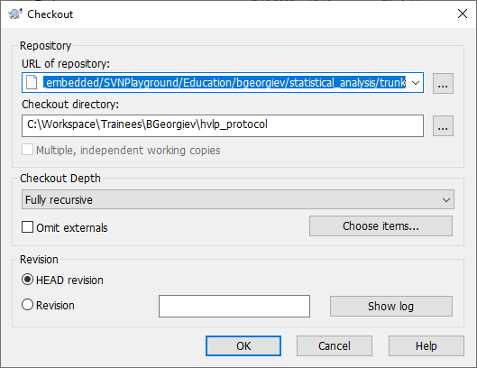
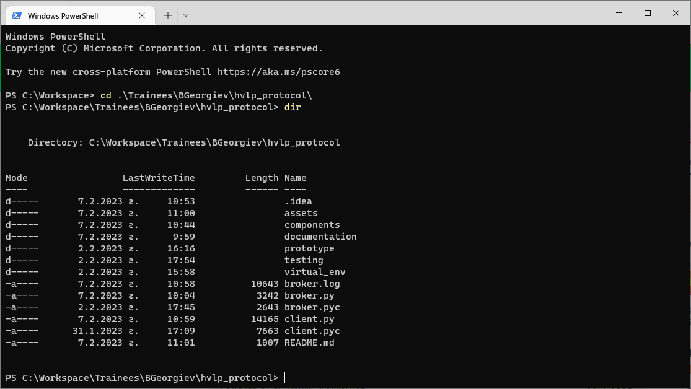
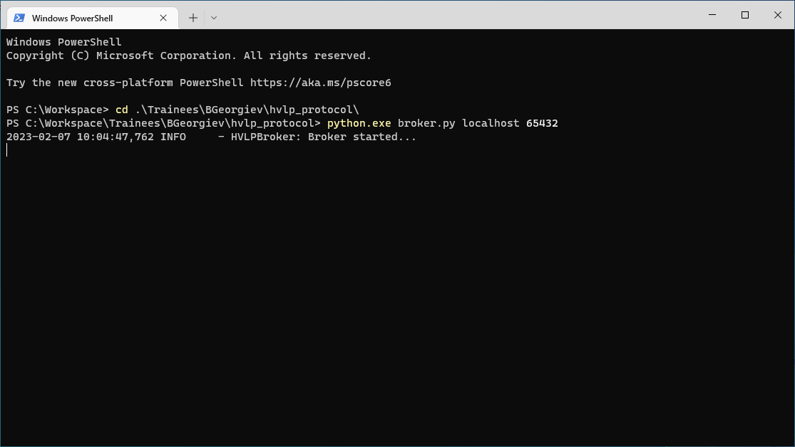
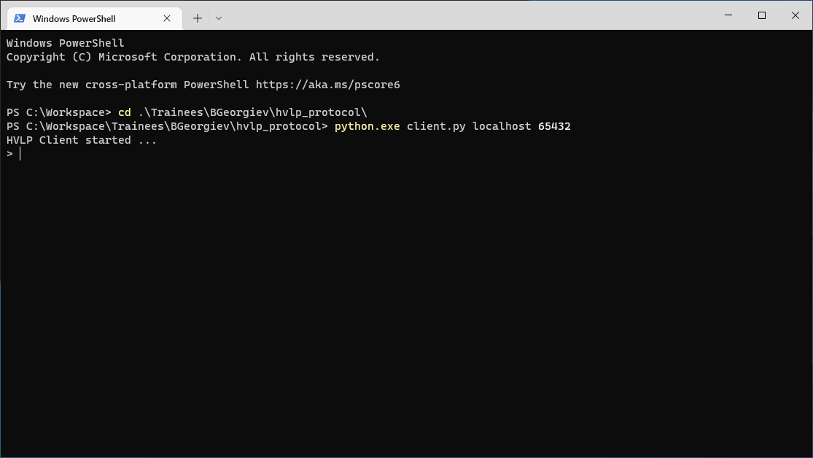
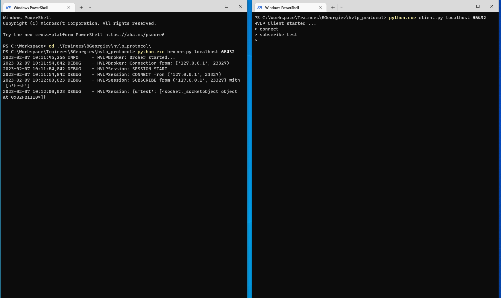
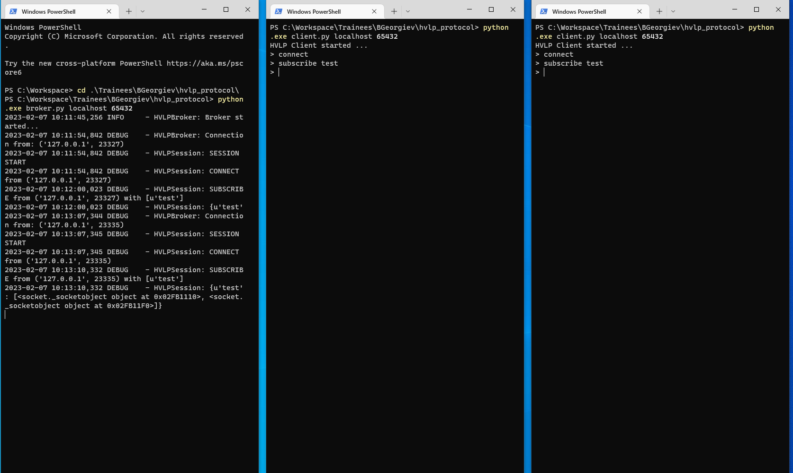
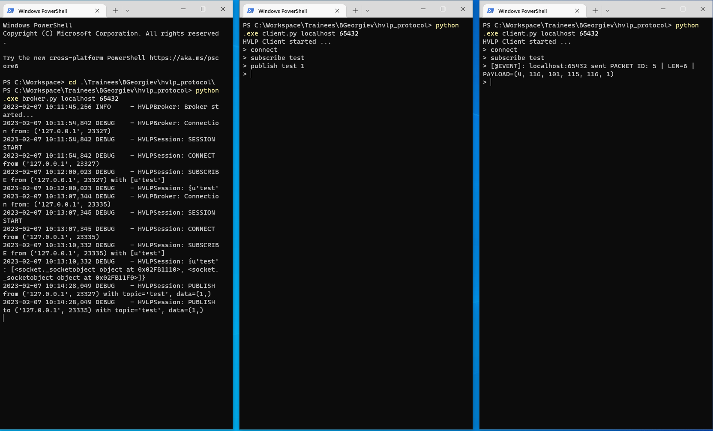
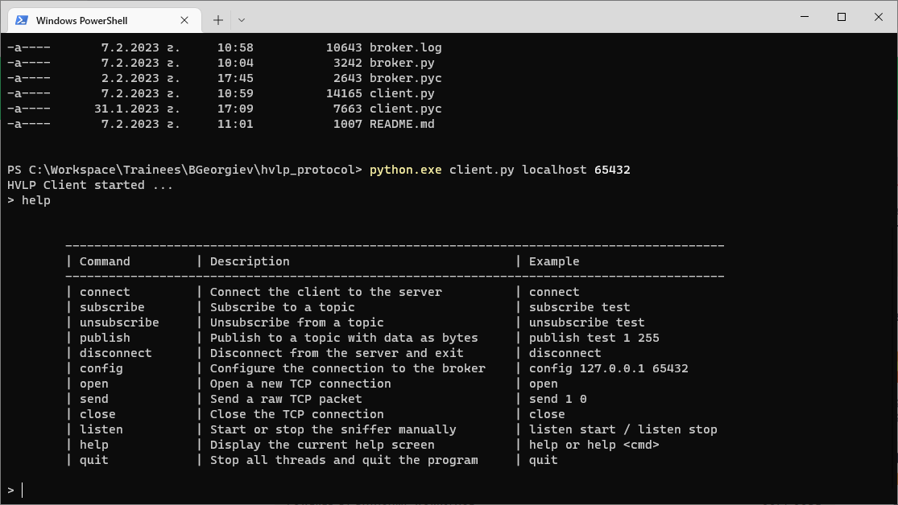

## Project Setup

### 1. Checkout the HVLP project

http://server.hilscherdtc.local:81/svn/hilscherdtc_embedded/SVNPlayground/Education/bgeorgiev/hvlp_protocol

### 2. Go to the project folder

### 3. Open a new command terminal for the broker

Type `python broker.py <IP ADDR> <PORT>` to start the broker. If omitted the default IP is 127.0.0.1 and the default port is 65432.

### 4. Open a new command terminal for a client

Type `python client.py <SERVER ADDR> <PORT>` to start the client. If omitted the default server 
address is 127.0.0.1 and the default port s 65432.

### 5. Connect the client to the broker

Type `connect` in the client console to connect to the broker

### 6. Subscribe the client to a topic

Type `subscribe test` in the client console to subscribe to a topic

### 7. Repeat steps 4-6 to add a second client

### 8. Publish to a topic

Type publish test 1 in one of the client consoles.

### 9. Get help how to use the application

Type `help` in the client console for more commands

### 10. Exit the applications

Type `quit` or press CTRL + C in a client console to exit the client. To exit the broker press 
CTRL + C. There might be a slight delay (1-2 seconds) until the application ends.

 

