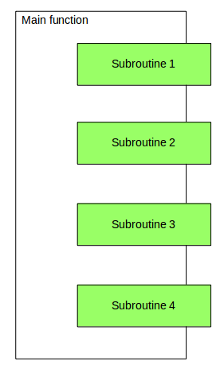

Table of contents
=================

<!--ts-->
   * [Overview](#overview)
     * [Syntax](#syntax)
     * [Chaining](#chaining)
   * [Comparison](#python-coroutine)
      * [Coroutine vs Subroutine](#coroutine-vs-subroutine)
      * [Coroutine vs Thread](#coroutine-vs-thread)
      * [Coroutine vs Handler Class](#coroutine-vs-handler-class)
   * [Usecases](#usecases)
   * [Resources](#resources)
<!--te-->

# Overview

_______________________________________________________________________________________________________________________

Coroutines are a special type of generator functions and represent generalizations of subroutines. They are used for 
**cooperative multitasking** where a process voluntarily yields (gives away) control periodically or when idle in 
order to enable multiple applications to be run simultaneously. Typically they are used to wait for a signal from 
another subroutine or coroutine to resume its execution.

The execution of the coroutine is similar to the generator. The coroutine runs only in response to the `next` and 
`send` methods. The first `next` or `send` activates the coroutine and runs untils it reaches the first **yield** 
statement.

## Syntax

Coroutines can produce and consume data. A typical usecase with both operations is

     def coroutine(...):
          input = yield output
          ...

Here the coroutine will read the input value with `input = yield` and generate an output value with `yield output`. 
Typically coroutines are used mainly to read values sent by the user application. Data can be sent to the couritine 
using the `send()` method of the generator functions.

Example:

     def coroutine():
        print("Coroutine has been started!")
        output = "foo"
        while True:
            text = yield output
            print("Coroutine received :", text)
            output = text[::-1] if text else "boo"
     
     
     cr = coroutine()
     print("Coroutine sent : {0}".format(next(cr)))
     print("Coroutine sent : {0}".format(next(cr)))        
     print("Coroutine sent : {0}".format(cr.send("abc")))    

The first usage of next will activate the coroutine, activate the loop and generate the first result. The second 
usage of next will activate the coroutine, evaluate data received with **text = yield ...**, generate the desired output and then send the data with 
**... yield output**. It must be noted that `next()` will send `None` as data to the coroutine and it is used mainly 
to generate values.

## Chaining

Coroutines can be used to set pipes. We can chain together coroutines and push data through the pipe using send() 
method. A pipe needs :

1. An initial source(producer) derives the whole pipeline.
2. A sink, which is the endpoint of the pipe. A sink might collect all data and display it.

# Comparions

_______________________________________________________________________________________________________________________

## Coroutine vs Subroutine

| Subroutine                               | Coroutine                                |
| ------------------------------------     | ---------------------------------------- |
|       |        |

* Coroutines can suspend and resume its execution
* Couritines can be resumed from many places
* Coroutines require cooperation by the calling application

## Coroutine vs Thread

* Threads are managed by the operating system
* Coroutines are managed by the program and the programming language

## Coroutine vs Handler Class

* Handler Objects need a class and methods
* Handler Objects are slower

# Usecases

_______________________________________________________________________________________________________________________

1. Pipelines used to filter or to map objects
2. Finite state machines
3. Event handling
4. Milti-tasking
5. Callbacks replacement

# Excercises

_______________________________________________________________________________________________________________________

1. Write a simple coroutine which sends and receives data
2. Write a program which stops a coroutine
3. Write a simple decorator to activate a coroutine
4. Write a coroutine which computes the running average
6. Write a random bitstream generator 
7. Write a pipeline
8. Write simple finite state machine
9. Write a program to generate permutations using recursive coroutines
10. Write a simple multi-tasking OS using coroutines

# Resources

* https://www.geeksforgeeks.org/coroutine-in-python/
* https://www.python-course.eu/python3_generators.php
* https://www.youtube.com/watch?v=EnSu9hHGq5o

